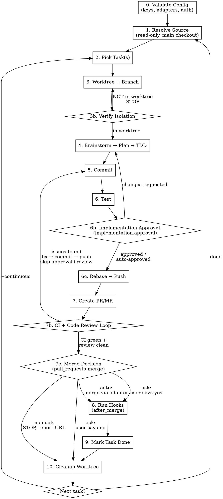

# flowyeah:build — Plan-to-PR Pipeline

Single command. Takes any source, produces tested, reviewed, merged PRs.

```
flowyeah:build [from <source>] [--continuous] [--intermittent]
```

## Sources

| Source | Example | Adapter |
|--------|---------|---------|
| No argument | `flowyeah:build` | Resume from `tmp/flowyeah/plans/` or ask |
| Conversation | `flowyeah:build` (mid-conversation) | Use current context |
| File | `flowyeah:build from docs/plans/redesign.md` | Read file directly |
| Prefix-based | `flowyeah:build from prefix:id` | Load `adapters/<prefix>/source.md` |

**Prefix-based sources** match the command prefix to a source adapter and config in `flowyeah.yml`:

- `flowyeah:build from gitlab:#5588` → reads `adapters.gitlab` config → loads `adapters/gitlab/source.md` (+ `connection.md`)
- `flowyeah:build from github:#45` → reads `adapters.github` config → loads `adapters/github/source.md` (+ `connection.md`)
- `flowyeah:build from linear:PROJ-123` → reads `adapters.linear` config → loads `adapters/linear/source.md` (+ `connection.md`)
- `flowyeah:build from bugsink:68b87507-8b6f-4250-9d5c-55a1dc39d9c6` → reads `adapters.bugsink` config → loads `adapters/bugsink/source.md` (+ `connection.md`)
- `flowyeah:build from newrelic:MXxBUE18...` → reads `adapters.newrelic` config → loads `adapters/newrelic/source.md` (+ `connection.md`)

New source? Create an adapter directory with `connection.md` + `source.md`, add config to `flowyeah.yml` under `adapters`. Zero changes to this skill.

If source is prose without tasks: brainstorm with the user, generate a task plan, save as canonical format.

## Canonical Plan Format

```markdown
# Plan: <title>

## Tasks
- [ ] Task description
- [ ] Another task
  - [ ] Subtask A (leaf — this gets picked first)
  - [ ] Subtask B
- [x] Completed task
```

Nesting uses standard markdown indentation (2 spaces). Only **leaf tasks** (no children) are picked for implementation. A parent task is automatically marked `[x]` when all its children are done.

Saved to `tmp/flowyeah/plans/<key>.md` in the main checkout.

**Plan key derivation:**

| Source | Key | Example path |
|--------|-----|--------------|
| `gitlab:#5588` | `gitlab-5588` | `tmp/flowyeah/plans/gitlab-5588.md` |
| `linear:PROJ-123` | `linear-proj-123` | `tmp/flowyeah/plans/linear-proj-123.md` |
| `github:#45` | `github-45` | `tmp/flowyeah/plans/github-45.md` |
| `bugsink:68b87507-...` | `bugsink-68b87507` | `tmp/flowyeah/plans/bugsink-68b87507.md` |
| `newrelic:MXxBUE18...` | `newrelic-mxxbue` | `tmp/flowyeah/plans/newrelic-mxxbue.md` |
| `ghactions:65262548526` | `ghactions-65262548526` | `tmp/flowyeah/plans/ghactions-65262548526.md` |
| File source | slugified filename | `tmp/flowyeah/plans/redesign.md` |
| Conversation (no source) | slugified work description | `tmp/flowyeah/plans/webhook-retry.md` |

Plan keys are filesystem identifiers for deduplication — they use a minimal GUID prefix. Branch names (see table below) may use a different, more descriptive slug strategy defined by each adapter (e.g., NEWRELIC includes the error class in the branch name for readability).

The `tmp/` directory should be gitignored. Plans are developer process artifacts, not versioned deliverables.

## Pipeline



### 0. Validate Configuration

Before any pipeline step, validate the loaded `flowyeah.yml`:

1. **Load schema:** read `config-schema.md` from the plugin root.
2. **Check required keys:** verify all keys marked **required** in the "Current Schema" section are present and have valid values.
3. **Run validation rules:** execute all checks from the "Validation Rules" section. Errors STOP the pipeline; warnings are reported but don't block.
4. **Auth verification:** for each adapter that will be used in this run (determined by the source command and hosting), verify credentials are reachable:
   - Adapters with `token_env` + `token_source` → check the env var exists (via the token source file)
   - `github` → verify `gh auth status` succeeds
   - `linear` → verify Linear MCP is available
5. **Report all issues at once** — don't fail on the first error. Collect all validation failures and present them together so the user can fix everything in one pass.

If validation fails, STOP with actionable error messages. Do not proceed with a broken config.

### 1. Resolve Source

Parse command arguments, read content, convert to canonical plan format. Save to `tmp/flowyeah/plans/<key>.md`.

- **GitHub Actions URL:** if the source argument matches a GitHub Actions job URL (`github.com/.*/actions/runs/.*/job/.*`), parse it to extract `owner/repo`, `run_id`, and `job_id`. Route to `ghactions` adapter with all parsed fields — the adapter uses `job_id` for metadata and `run_id` for fetching failed logs. Key: `ghactions-<job_id>`.
- **Bugsink URL:** if the source argument matches a Bugsink URL (host matches `adapters.bugsink.url`, path contains `/issues/issue/<uuid>`), extract the issue UUID from the path. Route to `bugsink` adapter. Key: `bugsink-<first-8-chars-of-uuid>`.
- **Prefix source (e.g., `gitlab:#5588`):** verify prefix matches an adapter in `flowyeah.yml` `adapters` that has a `source.md`. Load `adapters/<prefix>/connection.md` + `adapters/<prefix>/source.md`, read its config from `flowyeah.yml` `adapters.<prefix>`, follow the adapter's instructions to fetch and convert to canonical format. Key: `<prefix>-<id>` (e.g., `gitlab-5588`). **Save the adapter's Issue Linkage values** (`Issue-Ref`, `Issue-Close`) — these will be written to `state.md` in Step 3 and used for PR/MR title and body in Step 7.
- **File source:** read file, convert to canonical format. Key: slugified filename without extension. The source file is never mutated — the plan is a copy in `tmp/`.
- **Prose/idea:** brainstorm with user, generate tasks. Key: slugified description of the work (ask or infer from conversation).
- **No source + plans exist in `tmp/flowyeah/plans/`:**
  - One plan with unchecked tasks → resume it.
  - Multiple plans with unchecked tasks → show list, ask which to resume.
- **No source + no plans:** ask what the user wants to work on.

### 2. Pick Task(s)

- Find first unchecked `[ ]` task in the active plan (`tmp/flowyeah/plans/<key>.md`, from main checkout)
- Check claims: `git branch -a` — branch with task slug exists → skip to next
- Nested tasks: pick first unchecked leaf
- **No tasks remaining:** Report "Plan complete" and exit
- **Small related tasks:** batch into one worktree/branch/PR. Use judgment unless told otherwise.

### 3. Worktree + Branch

Create worktree and branch. **Always worktree, always branch.**

**Before creating the worktree**, verify `flowyeah.yml` is committed. If it's untracked or modified, commit it first — worktrees are created from the current branch HEAD, so uncommitted files won't be present in the worktree and the injection hook will silently fail.

```bash
# Read git.default_branch from flowyeah.yml (default: main)
git checkout $DEFAULT_BRANCH && git pull origin $DEFAULT_BRANCH
mkdir -p .flowyeah/worktrees tmp/flowyeah/plans
git check-ignore -q .flowyeah/worktrees 2>/dev/null || echo ".flowyeah/" >> .gitignore
git check-ignore -q tmp/flowyeah 2>/dev/null || echo "tmp/" >> .gitignore
git worktree add .flowyeah/worktrees/<type>-<slug> -b <type>/<slug>
```

**Branch naming:**

| Source | Branch name |
|--------|-------------|
| linear:PROJ-123 | `<type>/PROJ-123` |
| gitlab:#5588 | `<type>/5588` |
| github:#45 | `<type>/45` |
| ghactions:12345678 | `fix/ci-<last_6_digits>` (always `fix`, see adapter) |
| newrelic:MXxBUE18... | `fix/<error-class-slug>-<guid-prefix>` (always `fix`, see adapter) |
| Prose/idea | `<type>/<slug>` |

**Type inference:**

| Task pattern | Type |
|--------------|------|
| "Add...", "Implement...", "Create..." | `feat` |
| "Fix...", "Resolve...", "Correct..." | `fix` |
| "Refactor...", "Extract...", "Move..." | `refactor` |
| "Update deps", "Configure..." | `chore` |
| Ambiguous | Ask the user |

**Claim issue (when source is an issue tracker):**

If the source came from an issue tracker (GITLAB, GITHUB, LINEAR), assign the issue to the current dev now — before any implementation begins. This signals to the team that someone is working on it.

- **GitLab:** use the hosting adapter's "Issue Assignment" section
- **GitHub:** `gh issue edit <number> --add-assignee "@me"`
- **Linear:** `save_issue(id: "<id>", assignee: "me")` via MCP

If the source is not an issue tracker (prose, BUGSINK, NEWRELIC), skip — there's no issue to claim. Issue creation stays at Step 7b (`issues.create_when_missing`).

Create session directory and state files in the worktree:

```bash
mkdir -p .flowyeah
```

Write 4 session files (see Session Management section below). If `--intermittent` was passed, set `Investigation: intermittent` in `state.md` — this switches Step 4 from standard debugging to the escalating intermittent-failure investigation.

**Worktree symlinks:**

After writing session files, resolve `worktree.symlinks` from `flowyeah.yml`. For each entry:

```bash
MAIN_WORKTREE=$(git worktree list --porcelain | head -1 | sed 's/worktree //')
TARGET="$MAIN_WORKTREE/<path>"

# Skip if target doesn't exist in main checkout
if [ ! -e "$TARGET" ]; then
  echo "Warning: symlink target not found, skipping: <path>"
  continue
fi

# Create parent directories if needed (for nested paths like vendor/bundle)
mkdir -p "$(dirname "<path>")"

ln -s "$TARGET" "<path>"
```

If `worktree.symlinks` is empty or absent, skip this step entirely.

**Worktree environment setup:**

After writing session files, resolve `worktree.env` from `flowyeah.yml`:

1. For each entry in `worktree.env`: if value is `auto`, generate a random 8-char URL-safe base64 string (no padding); otherwise use the literal value.
2. Write the resolved key-value pairs to `state.md` under a `## Worktree Env` section (see state.md template below).
3. Export the resolved env vars into the current shell environment.
4. Run each command in `worktree.setup` sequentially, with the env vars exported. If any setup command fails, STOP and report — do not proceed to implementation with broken dependencies.

```bash
# Generate env values (for each "auto" entry)
VALUE=$(head -c 6 /dev/urandom | base64 | tr '+/' '-_' | tr -d '=')

# Export all resolved env vars
export TEST_ENV_NUMBER=aB3xK9mQ
export REDIS_DB=pL7nR2wY

# Run setup commands
bundle exec rails db:test:prepare
```

If `worktree.env` is empty or absent, skip this step entirely.

### 3b. Verify Worktree Isolation

```bash
git rev-parse --show-toplevel | grep -qF '.flowyeah/worktrees/' || echo "NOT IN WORKTREE — STOP"
```

**NEVER write code outside a worktree.** Analysis and planning are OK. Code changes are not.

**Resolving the main checkout path** (needed for plan files in `tmp/` and cleanup):

```bash
MAIN_WORKTREE=$(git worktree list --porcelain | head -1 | sed 's/worktree //')
```

Use `$MAIN_WORKTREE/tmp/flowyeah/plans/<key>.md` to access plan files from inside a worktree.

### 4. Implement

**Check `implementation.brainstorm` in `flowyeah.yml`:**

- **`always`** — brainstorm → plan → TDD for every task, regardless of apparent complexity. Use this for large or complex codebases where even small changes need discussion.
- **`auto`** (default) — trivial tasks (single config change, rename, docs-only) go straight to TDD; non-trivial tasks go through the full brainstorm → plan → TDD cycle.

**Full cycle (when brainstorming):**
1. **Brainstorm** — explore task, constraints, edge cases. Use `superpowers:brainstorming`.
2. **Plan** — create implementation steps. Use `superpowers:writing-plans`.
3. **TDD** — test first, minimal code, refactor. Use `superpowers:test-driven-development`.
4. Update `state.md` on every phase transition.

**Direct TDD (when skipping brainstorm):**
1. Write failing test → make pass → refactor. Use `superpowers:test-driven-development`.
2. Update `state.md` after completion.

**When `Investigation: intermittent` is set in state.md:**

Replace the standard investigation with an escalating approach. The goal is to identify why a test fails intermittently, not just make it pass once.

**Escalation levels** (stop as soon as the cause is found):

1. **Run the failing test in isolation.** Does it fail by itself? If yes, the failure is not intermittent — fall back to `superpowers:systematic-debugging`.

2. **Check ordering dependency.** Run the full spec file (or suite) with the seed from the CI log. Reproduce the failure with the same test ordering.

3. **Analyze shared state.** Look for: database records leaking between tests, global variable mutation, file system side effects, time-dependent assertions (`Time.now`, `Date.today`), external service dependencies.

4. **Framework-specific bisect.** If the above don't reveal the cause:

   | `testing.command` contains | Bisect approach |
   |----------------------------|-----------------|
   | `rspec` | `rspec --bisect --seed <seed>` |
   | `pytest` | `pytest --randomly-seed=<seed>` + manual narrowing |
   | `jest` | `jest --runInBand` to isolate ordering effects |
   | Other | Report automated bisect is unavailable, suggest manual investigation |

5. **STOP and report.** If bisect doesn't reveal the cause, the problem may be infrastructure-level (timing, external services, resource contention). Present findings and ask for guidance.

### 5. Commit

How much effort goes into commit messages depends on `pull_requests.merge_strategy`:

| `merge_strategy` | Commit message effort | Why |
|-------------------|----------------------|-----|
| `squash` | **Minimal.** Clear and descriptive, but no conventions or writer agent needed. These commits will be squashed — the PR title+description is what survives (see Step 7). | Individual commits are thrown away on merge. |
| `rebase` | **Full.** Apply `commits.conventions` and `commits.writer`. These commits ARE the final history — they land directly on the target branch. | No merge commit; individual commits are the permanent record. |
| `merge` | **Full.** Apply `commits.conventions` and `commits.writer`. Individual commits are visible in branch history. | Both merge commit (PR title) and branch commits survive. |

### 6. Test

**Before running tests**, export the worktree env vars from `state.md`'s `## Worktree Env` section. These must be active for every command that interacts with isolated dependencies (database, Redis, etc.).

```bash
# Export worktree env (read from state.md ## Worktree Env section)
export TEST_ENV_NUMBER=aB3xK9mQ
export REDIS_DB=pL7nR2wY

# Test (from flowyeah.yml testing.command)
<testing.command> <scoped-spec-files>
```

**Test scope** (`testing.scope`):
- `related` — directly changed files and related integration/feature/system/e2e specs
- `full` — run the full test suite

### 6b. Implementation Approval

**Check `implementation.approval` in `flowyeah.yml`:**

- **`always`** — present the implementation for developer approval before pushing. For legacy, large, or critical codebases where every change needs human review before leaving the local environment.
- **`auto`** (default) — AI assesses risk: straightforward changes proceed to push automatically; complex, large, or high-risk changes ask for approval.

**When asking for approval**, present:
1. Summary of what was implemented and why
2. Files changed (count and list)
3. Test results summary

Then ask: **"Approve implementation?"** with options:
- **Approve** → continue to step 6c (push)
- **Request changes** → ask what to change, return to step 4 (implement)

**When `auto` skips approval**, log to `state.md` that approval was auto-granted with the rationale.

### 6c. Rebase → Push

```bash
# Rebase (if pull_requests.rebase is true)
git fetch origin $DEFAULT_BRANCH && git rebase origin/$DEFAULT_BRANCH

# Push (force-with-lease only after rebase; regular push otherwise)
if pull_requests.rebase; then
  git push -u origin $BRANCH --force-with-lease
else
  git push -u origin $BRANCH
fi
```

### 7. Create PR/MR

Load the hosting adapter from `adapters/<hosting>/connection.md` + `adapters/<hosting>/hosting.md`, read its config from `flowyeah.yml` `adapters.<hosting>`, and follow the adapter's instructions to create the PR/MR.

**The skill provides these values to the adapter:**
- **Source branch:** current branch
- **Target branch:** `git.default_branch`
- **Title:** see title rules below
- **Body:** see body rules below
- **Delete source branch:** `pull_requests.delete_source_branch`

**PR/MR title and body are the permanent record when squashing.** How much effort goes into them depends on `merge_strategy`:

| `merge_strategy` | Title + body effort | Why |
|-------------------|---------------------|-----|
| `squash` | **Full.** Apply `commits.conventions` and `commits.writer` to the PR title+description. The title becomes the squash commit message — it IS the final history. | Individual commits are thrown away; PR title survives. |
| `merge` | **Full.** Apply `commits.conventions` and `commits.writer`. The title becomes the merge commit message. | Merge commit (PR title) is what shows in `git log --first-parent`. |
| `rebase` | **Minimal.** Descriptive title in `language`, but no conventions or writer agent needed. Individual commits (Step 5) already carry the conventions. | PR title is UI-only; individual commits are the permanent record. |

**Title rules:**
- In `language`
- If `Issue-Ref` exists in `state.md`, append it in parentheses at the end — e.g., `Implementar retry de webhook (#5588)` or `Add payment validation (PROJ-123)`
- When `commits.conventions` applies (see table above): follow the convention (e.g., `feat: implementar retry de webhook (#5588)`)

**Body rules:**
- Summary of changes
- If `Issue-Close` exists in `state.md`, include it — e.g., `Closes #5588`
- When `commits.writer` applies (see table above): delegate to the writer agent for both title and body

Code review results are reported in the terminal only — this is your current work session, not a team review artifact.

### 7b. CI + Code Review Loop

**Do NOT give the prompt back.** Stay in the loop until CI passes and reviews are clean. Use the hosting adapter for CI polling.

**While waiting for CI:**

1. **Run code review agents** from `flowyeah.yml`:
   - **`code_review.agents`** — always launch all of these.
   - **`code_review.optional_agents`** — launch based on what changed (e.g., security-analyst if auth code was touched, code-quality-analyst for large refactors). Use judgment.
   - **If `code_review.agents` is empty or missing: STOP and complain. Do NOT continue without code review.**

   If `code_review.instructions` is configured, include the file contents as additional context passed to each agent alongside the diff and changed files.

2. **Issue creation opportunity.** If the source was NOT an issue tracker (i.e., it was a file or a conversation), you MUST check `issues.create_when_missing`:

   | `issues.create_when_missing` | Action |
   |------------------------------|--------|
   | `ask` | **STOP and ask the user:** "Deseja criar uma issue para rastrear este trabalho?" If yes, create via `issues.adapter`. If no, skip. **You MUST ask — do not silently skip.** |
   | `always` | Create one automatically via `issues.adapter`. |
   | `never` | Skip silently. |

   When creating an issue, use the source adapter pointed to by `issues.adapter` to create it. Save the resulting Issue Linkage values (`Issue-Ref`, `Issue-Close`) to `state.md` — they will be used for the PR title and body.

**When results come back:**

- **CI passes AND review clean** → proceed to step 7c (merge decision)
- **CI fails** → investigate, fix, create a new commit (not amend), restart from step 5 (commit → test → push). Skip code review and implementation approval on retry. Any CI failure is YOUR failure. Assume CI is evergreen.
- **Review agents find issues** → fix, create a new commit, restart from step 5 (commit → test → push). Skip code review and implementation approval on retry — the review already told you what to fix.
- **CI fails 3 times** → STOP and ask for guidance

**Git strategy for fixes:** Always create new commits, never amend. The PR will be squash-merged anyway (per `merge_strategy`), so individual fix commits don't clutter the final history. New commits also make it easier to review what changed between CI runs.

### 7c. Merge Decision

**CRITICAL — you MUST respect `pull_requests.merge` before merging anything:**

| `pull_requests.merge` | Action | Can you merge? |
|----------------------|--------|----------------|
| `auto` | Use the hosting adapter to merge | Yes |
| `manual` | **STOP.** Report the PR/MR URL and do NOT merge. Do NOT proceed to step 8. Skip directly to step 9 (mark task) and step 10 (cleanup). | **No. Never.** |
| `ask` | **STOP.** Ask the user: "Merge agora?" with options Yes/No. Only merge if they say yes. If they say no, report the PR/MR URL, skip to step 9 and 10. | **Only if user says yes** |

**If `pull_requests.merge` is `manual` or `ask` (and user says no), the pipeline ends here for this task.** Steps 8 (hooks) only run after a successful merge — skip them. Proceed to step 9 (mark task done in plan) and step 10 (cleanup worktree), then pick the next task.

**Merge failure recovery (auto mode only):**
- **Merge conflict** (target branch moved ahead): rebase onto target, resolve conflicts, push, wait for CI again
- **Protected branch rejection** (insufficient permissions, required approvals): report the error and switch to `manual` mode — show the PR URL and let the user handle it
- **Concurrent merge** (another PR merged first, branch is stale): same as merge conflict — rebase and retry once

### 8. Run Hooks

After a successful merge, check `hooks` in `flowyeah.yml` for any configured hook points. Each hook is a path to a markdown file (relative to the project root) containing instructions for the AI to follow.

**Available hook points:**

Currently only `after_merge` is implemented. More hook points (e.g., `before_push`, `after_pr_create`) will be added as real use cases emerge.

| Hook | When it runs | Context available |
|------|-------------|-------------------|
| `after_merge` | After successful merge, before marking task done | Branch, MR/PR iid+url, issue number (if any), adapter config |

**Execution:**

1. Check if the hook point exists in `flowyeah.yml` `hooks` section
2. If present, read the markdown file at the configured path
3. Follow the instructions in the file, using the pipeline context (branch name, MR/PR details, issue reference, adapter config from `flowyeah.yml`)
4. If the file doesn't exist, warn the user and continue

**Hooks are best-effort.** The merge already happened — the code is delivered. If hook instructions fail (API error, resource not found, permission denied), report the failure to the user with details, suggest manual action, and continue to step 9. Do not retry, do not roll back the merge.

**Hook files** are project-level artifacts, versioned with the project. They follow the same pattern as adapters: markdown instructions that the AI reads and follows.

**Example `flowyeah.yml`:**
```yaml
hooks:
  after_merge: .flowyeah/hooks/after-merge.md
```

**Example hook file** (`.flowyeah/hooks/after-merge.md`):
```markdown
# After Merge: Associate Milestone

1. Read current version from line 5 of CHANGELOG
2. Calculate next patch version
3. Find or create milestone with that version
4. Associate the MR and issue to the milestone
```

If no hooks are configured, this step is a no-op.

### 9. Mark Task Done + Close Session

- Promote qualified findings from `.flowyeah/findings.md` to auto memory
- Check `[x]` in `tmp/flowyeah/plans/<key>.md` (from main checkout, after merge)
- If the source was an issue tracker, update the issue status:
  - **GitLab:** auto-closed via `Closes #<iid>` in MR description (no action needed)
  - **GitHub:** auto-closed via `Closes #<number>` in PR body (no action needed)
  - **Linear:** call `save_issue(id: "<id>", state: "Done")` via MCP
  - **Bugsink/New Relic:** no action — errors auto-resolve when the fix is deployed

### 10. Cleanup Worktree

Removes the worktree and everything in it, including `.flowyeah/` session files.

**Before removing the worktree**, run teardown commands to clean up isolated dependencies:

1. Read env vars from `state.md`'s `## Worktree Env` section
2. Export them
3. Run each command in `worktree.teardown` sequentially
4. Teardown is best-effort — if a command fails (e.g., database already dropped), warn and continue with cleanup

```bash
# Export worktree env and run teardown (before removal)
export TEST_ENV_NUMBER=aB3xK9mQ
export REDIS_DB=pL7nR2wY
bundle exec rails db:drop DISABLE_DATABASE_ENVIRONMENT_CHECK=1

# Remove worktree
cd "$MAIN_WORKTREE"
git checkout $DEFAULT_BRANCH && git pull origin $DEFAULT_BRANCH
git worktree remove <worktree-path>
```

## Continuous Mode (`--continuous`)

```
loop:
  1. Pick next task
  2. None left? → "Plan complete" → exit
  3. Worktree → implement → commit → test → push → PR → CI loop
  4. Stop condition hit? → stop and ask
  5. Success? → back to step 1
```

**Stop conditions for continuous mode:**
- Any stop condition from the general list (ambiguous task, 3x CI failure, architectural decision needed, etc.)
- User sends an interrupt message
- All tasks in the plan are complete

## Plan Lifecycle

Plans in `tmp/flowyeah/plans/` accumulate over time. Cleanup rules (evaluated in order — first match wins):

1. **Completed plans** (all tasks `[x]`, last modified >7 days ago): delete silently, log to stdout
2. **Active plans** (unchecked tasks remain): never auto-delete
3. **Orphaned plans** (not completed, no matching branches, last modified >30 days ago): warn the user and offer to delete

On each `flowyeah:build` run, before resolving the source, check for stale plans and clean up. First-match-wins means a completed plan is always cleaned up at 7 days — it never reaches the 30-day orphaned check.

## Session Management

Session state lives in `.flowyeah/` inside the worktree. It survives context compaction (via hook injection) and crashes (files persist on disk). Cleaned up with the worktree in step 10.

### Session Files

```
.flowyeah/worktrees/<type>-<slug>/
└── .flowyeah/
    ├── state.md       # WHERE — current position + decision context
    ├── mission.md     # WHY — goal, scope, success criteria
    ├── progress.md    # WHAT — task checklist with stats
    └── findings.md    # LEARNED — discoveries, gotchas, insights
```

### state.md — Rich Context (update very frequently)

Must have parseable header lines for crash recovery summaries:

```markdown
# Current State

Type: build
Status: Implementing
Step: 4 (Implement) — TDD phase
Mode: single                          # single | continuous
Task: Webhook retry logic
Source: gitlab:#5588
Plan: tmp/flowyeah/plans/gitlab-5588.md  # relative to main checkout
Branch: feat/5588
Worktree: .flowyeah/worktrees/feat-5588
Issue-Ref: #5588                      # from source adapter's Issue Linkage
Issue-Close: Closes #5588             # close keyword for PR/MR body
Investigation: intermittent            # set in Step 3 when --intermittent flag is passed

## Worktree Env
TEST_ENV_NUMBER=aB3xK9mQ
REDIS_DB=pL7nR2wY

## Key Decisions Made
- Chose exponential backoff over linear retry (better for rate-limited APIs)
- Max 5 retries with jitter to avoid thundering herd
- Using ActiveJob retry mechanism rather than custom loop

## What's Been Done
- Brainstormed 3 approaches
- Plan: 4 implementation steps
- Steps 1-2 complete: model and service layer
- Step 3 in progress: controller integration

## Dead Ends
- Tried custom retry loop with sleep — race condition with Sidekiq's own retry
- Tried rescue_from in controller — too late, webhook already marked as failed

## Current Focus
Writing failing feature spec for webhook retry behavior.

## Next Action
Complete the feature spec, then implement the controller action.
```

**Update when:** every pipeline step transition, every phase transition within step 4, after completing subtasks, after discovering dead ends, after making key decisions. The more context here, the better a resumed session performs.

### mission.md — Goal (update rarely)

```markdown
# Mission

Implement webhook retry with exponential backoff for failed deliveries.

## Scope
- Retry mechanism with configurable max attempts
- Exponential backoff with jitter
- Dead letter queue for permanently failed webhooks
- Admin UI to view retry status

## Success Criteria
- [ ] Failing webhooks are retried up to 5 times
- [ ] Backoff is exponential with jitter
- [ ] Permanently failed webhooks go to dead letter queue
- [ ] Admin can see retry history
- [ ] All tests pass, CI green
```

### progress.md — Checklist (update after each item)

```markdown
# Progress

## Items
- [x] Design retry strategy
- [x] Implement retry model
- [ ] Implement retry service
- [ ] Controller integration
- [ ] Feature specs

## Stats
- Total: 5
- Done: 2
- Remaining: 3
```

### findings.md — Accumulated Knowledge (update after discoveries)

```markdown
# Findings

## Summary
ActiveJob's retry_on has a quirk: exponential backoff is capped at
the job's max wait time, not the retry count. Set both explicitly.

## Details

### ActiveJob retry_on gotcha
The `wait` parameter in retry_on accepts a lambda but the exponential
calculation is capped by `retry_jitter` config. Must set both:
  retry_on WebhookError, wait: :polynomially_longer, attempts: 5
  self.retry_jitter = 0.15
```

Keep `## Summary` current — the injection hook only shows the summary section, not full details.

### Hook-Based Injection

Two hooks (installed via this plugin's `hooks/hooks.json`) power session recovery:

1. **`UserPromptSubmit`** — `session-inject.sh` injects all 4 files on every prompt (findings: summary only). This is how state survives context compaction.

2. **`PostToolUse` on Edit/Write** — `session-remind.sh` nudges to update state.md after making changes.

Both scripts are guarded: exit silently if no `flowyeah.yml` in project or no active `.flowyeah/` session.

### Context Compaction Recovery

After compaction, the hook re-injects state automatically:
1. Read injected state to find current position
2. Continue from where `state.md` indicates
3. Do NOT restart the task from scratch

### Crash Recovery

After a crash, the user returns to the main checkout. Run `flowyeah:build`:
1. Scan `.flowyeah/worktrees/*/.flowyeah/state.md` for active sessions
2. If one session: resume it directly
3. If multiple sessions: show summary and ask which to resume
   ```
   Active sessions:
   1. feat-5588         → Webhook retry logic (Step 4: TDD)
   2. fix-5590          → Payment validation (Step 7b: CI wait)
   3. chore-update-deps → Update dependencies (Step 7: Creating MR)
   ```
4. `cd` into chosen worktree and continue from state.md

### Pipeline Rollback

When a pipeline step fails irrecoverably (e.g., 3 CI failures, merge conflict that can't be resolved):

1. **Before worktree cleanup:** save `state.md` and `findings.md` to `tmp/flowyeah/aborted/<key>/` for post-mortem
2. **Reset the plan task:** uncheck `[x]` → `[ ]` in `tmp/flowyeah/plans/<key>.md` if it was prematurely marked
3. **Clean up remote:** delete the remote branch if the PR was already created but not merged
4. **Clean up worktree:** remove with `git worktree remove`
5. **Report:** summarize what happened, what was saved, and what the user should do next

The aborted session artifacts in `tmp/flowyeah/aborted/` persist for review. **Cleanup:** delete aborted entries older than 30 days during the plan lifecycle check (same timing as orphaned plan cleanup). Warn the user before deleting.

### Session End (step 9-10)

Before worktree cleanup:
1. Read `findings.md` and identify insights worth keeping
2. Promote qualified findings to auto memory (MEMORY.md or topic files)
3. Worktree removal in step 10 deletes the `.flowyeah/` directory

## Parallel Coordination

Before claiming a task, check if another instance is already working on it:
1. `git branch -a | grep -E 'feat/|fix/|refactor/|chore/'`
2. Branch with task slug exists → task claimed → pick next
3. Creating branch = claiming the task

**Known limitation:** Two `--continuous` sessions working on the same plan file can race when marking tasks as `[x]`. Branch coordination prevents picking the same task, but concurrent file writes are unguarded. Recommend one `--continuous` session per plan.

## Task Sizing

One task = one reasonable PR. If a task is too large:
1. Brainstorm/plan the task
2. Decompose into subtasks in `tmp/flowyeah/plans/<key>.md`
3. Execute first subtask
4. Next iteration picks next subtask

## Project Configuration — `flowyeah.yml`

All project conventions live in `flowyeah.yml` at the project root (versioned).

**Precedence:** `flowyeah.yml` overrides CLAUDE.md for all flowyeah operations. If flowyeah.yml says `default_branch: develop` and CLAUDE.md says something else, flowyeah.yml wins.

### First Run (no `flowyeah.yml`)

If `flowyeah.yml` does not exist, load `setup.md` from the plugin root and follow its interactive setup instructions. Then proceed with the pipeline.

### Schema

See `config-schema.md` at the plugin root for the full schema, types, defaults, and validation rules.

```yaml
# Example — see config-schema.md for full schema and defaults
language: pt-br
git:
  default_branch: develop
testing:
  command: bundle exec rspec
implementation:
  brainstorm: always
  approval: always
hosting: gitlab
adapters:
  gitlab:
    url: https://gitlab.example.com
    token_env: GITLAB_TOKEN
    token_source: .env
    project_id: 123
```

### Adapters

Adapters live in `adapters/` at the plugin level (shared across skills):

```
adapters/
├── gitlab/
│   ├── connection.md    # Auth, base URL, --form encoding
│   ├── source.md        # Fetch issue → canonical format
│   ├── hosting.md       # Create MR, poll CI, merge
│   └── review.md        # Fetch MR, post formal review
├── github/
│   ├── connection.md    # gh CLI auth
│   ├── source.md        # Fetch issue → canonical format
│   ├── hosting.md       # Create PR, poll CI, merge
│   └── review.md        # Fetch PR, post formal review
├── linear/
│   ├── connection.md    # MCP setup
│   └── source.md        # Fetch issue → canonical format
├── bugsink/
│   ├── connection.md    # API token auth
│   └── source.md        # Fetch error → canonical format
├── newrelic/
│   ├── connection.md    # NerdGraph auth
│   └── source.md        # Fetch error group → canonical format
└── ghactions/
    ├── connection.md    # gh CLI auth
    └── source.md        # Fetch CI job logs → canonical format
```

Each integration directory contains:
- **`connection.md`** — shared authentication, base URL, encoding conventions
- **`source.md`** — fetch data and convert to canonical format
- **`hosting.md`** — create PR/MR, poll CI, merge
- **`review.md`** — fetch PR/MR details, post formal review with inline comments

The core skill reads the adapter and follows its instructions. **Config lookup rule:** all adapter config is always under `adapters.<name>` in `flowyeah.yml`, regardless of whether the adapter is used as a source, hosting, or both. Adapter-specific config keys are schema-free — each adapter defines and validates its own keys.

**Adding a new integration:** create an adapter directory with `connection.md` + the adapter types you need, add config to `flowyeah.yml`. No changes to core skills.

## Stop Conditions

**STOP immediately and ask when:**

| Condition | Action |
|-----------|--------|
| Ambiguous task | Present interpretations, ask |
| No tasks remaining | Report plan status |
| Tests fail 3x | Show failures, ask for guidance |
| Architectural decision needed | Present options, ask |
| Missing dependency | State what's needed |
| No code review agents | STOP and complain |
| Auth failure (401/403) | Token may have expired — report the error and ask for a fresh token |
| Rate limited (429) | Wait for `Retry-After` duration (or 60s), retry once. If still limited, ask. |
| Transient API error (5xx, timeout) | Retry once after 5 seconds. If still failing, report and ask. |

**When stopping, always provide:**
1. What you were trying to do
2. What went wrong or is unclear
3. What you've already tried (if applicable)
4. Specific question — not "what should I do?" but "should I use approach A or B?"

## Never

- Write code outside a worktree (analysis and planning OK, code changes NOT)
- Skip code review to make progress
- Implement workarounds instead of asking
- Accept "good enough" implementations
- Ignore test failures, warnings, or errors
- Assume requirements when unsure
- Give back the prompt during CI wait
- **Waste effort on commit messages when `merge_strategy: squash`** — they're thrown away; apply conventions to the PR title instead
- **Skip conventions on PR title when `merge_strategy: squash` or `merge`** — the PR title IS the final commit message
- **Merge a PR/MR when `pull_requests.merge` is `manual`** — STOP and report the URL
- **Merge a PR/MR when `pull_requests.merge` is `ask` without asking the user first**
- **Skip the issue creation question when `issues.create_when_missing` is `ask`** — you MUST ask
