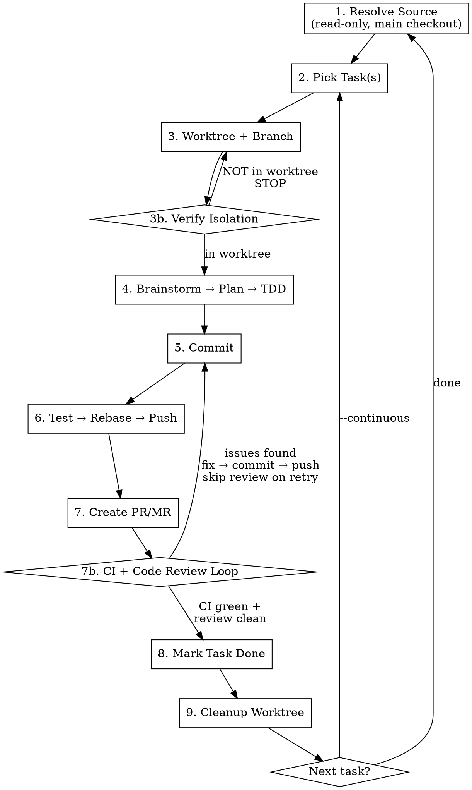

# /flowyeah — Plan-to-PR Pipeline

Single command. Takes any source, produces tested, reviewed, merged PRs.

```
/flowyeah [from <source>] [--continuous]
```

## Sources

| Source | Example | Adapter |
|--------|---------|---------|
| No argument | `/flowyeah` | Search `docs/plans/*.md` or ask |
| Conversation | `/flowyeah` (mid-conversation) | Use current context |
| File | `/flowyeah from docs/plans/redesign.md` | Read file directly |
| Prefix-based | `/flowyeah from PREFIX:ID` | Load `adapters/<prefix>/source.md` |

**Prefix-based sources** match the command prefix to a source adapter and config in `flowyeah.yml`:

- `/flowyeah from GITLAB:#5588` → reads `sources.gitlab` config → loads `adapters/gitlab/source.md` (+ `connection.md`)
- `/flowyeah from LINEAR:PROJ-123` → reads `sources.linear` config → loads `adapters/linear/source.md` (+ `connection.md`)
- `/flowyeah from BUGSINK:45678` → reads `sources.bugsink` config → loads `adapters/bugsink/source.md` (+ `connection.md`)
- `/flowyeah from NEWRELIC:MXxBUE18...` → reads `sources.newrelic` config → loads `adapters/newrelic/source.md` (+ `connection.md`)

New source? Create an adapter directory with `connection.md` + `source.md`, add config to `flowyeah.yml`. Zero changes to this skill.

If source is prose without tasks: brainstorm with the user, generate a task plan, save as canonical format.

## Canonical Plan Format

```markdown
# Plan: <title>

## Tasks
- [ ] Task description
- [ ] Another task
- [x] Completed task
```

Saved to `progress.md` in the working directory.

## Pipeline



### 1. Resolve Source

Parse command arguments, read content, convert to canonical plan format.

- **Prefix source (e.g., `GITLAB:#5588`):** load `adapters/<prefix>/connection.md` + `adapters/<prefix>/source.md`, read its config from `flowyeah.yml` `sources.<prefix>`, follow the adapter's instructions to fetch and convert to canonical format.
- **File source:** read file directly.
- **Prose/idea:** brainstorm with user, then generate tasks.
- **No source + `progress.md` exists:** resume from it.
- **No source + no plan:** ask what the user wants to work on.

### 2. Pick Task(s)

- Find first unchecked `[ ]` task in `progress.md`
- Check claims: `git branch -a` — branch with task slug exists → skip to next
- Nested tasks: pick first unchecked leaf
- **No tasks remaining:** Report "Plan complete" and exit
- **Small related tasks:** batch into one worktree/branch/PR. Use judgment unless told otherwise.

### 3. Worktree + Branch

Create worktree and branch. **Always worktree, always branch.**

```bash
DEFAULT_BRANCH=$(yq '.git.default_branch // "main"' flowyeah.yml)
git checkout $DEFAULT_BRANCH && git pull origin $DEFAULT_BRANCH
mkdir -p .worktrees
git check-ignore -q .worktrees 2>/dev/null || echo ".worktrees/" >> .gitignore
git worktree add .worktrees/<type>-<slug> -b <type>/<slug>
```

**Branch naming:**

| Source | Branch name |
|--------|-------------|
| LINEAR:PROJ-123 | `<type>/PROJ-123` |
| GITLAB:#5588 | `<type>/5588` |
| GITHUB:#45 | `<type>/45` |
| Prose/idea | `<type>/<slug>` |

**Type inference:**

| Task pattern | Type |
|--------------|------|
| "Add...", "Implement...", "Create..." | `feat` |
| "Fix...", "Resolve...", "Correct..." | `fix` |
| "Refactor...", "Extract...", "Move..." | `refactor` |
| "Update deps", "Configure..." | `chore` |
| Ambiguous | Ask the user |

Create session directory and state files in the worktree:

```bash
mkdir -p .flowyeah
```

Write 4 session files (see Session Management section below).

### 3b. Verify Worktree Isolation

```bash
git rev-parse --show-toplevel | grep -q '.worktrees/' || echo "NOT IN WORKTREE — STOP"
```

**NEVER write code outside a worktree.** Analysis and planning are OK. Code changes are not.

### 4. Implement

**Trivial tasks** (single config change, rename, docs-only): TDD directly.

**Non-trivial tasks:**
1. **Brainstorm** — explore task, constraints, edge cases. Use `superpowers:brainstorming`.
2. **Plan** — create implementation steps. Use `superpowers:writing-plans`.
3. **TDD** — test first, minimal code, refactor. Use `superpowers:test-driven-development`.
4. Update `state.md` on every phase transition.

### 5. Commit

Commit using project conventions from `flowyeah.yml`:
- Language: `commits.language`
- Conventions: `commits.conventions`
- Writer agent: `commits.writer` (if set, delegate to that agent; otherwise commit manually)

### 6. Test → Rebase → Push

```bash
# Test (from flowyeah.yml testing.command)
<testing.command> <scoped-spec-files>

# Rebase (if pull_requests.rebase is true)
git fetch origin $DEFAULT_BRANCH && git rebase origin/$DEFAULT_BRANCH

# Push
git push -u origin $BRANCH --force-with-lease
```

**Test scope** (`testing.scope`):
- `related` — directly changed files and related integration/feature/system/e2e specs
- `full` — run the full test suite

### 7. Create PR/MR

Load the sink adapter from `adapters/<sink.adapter>/connection.md` + `adapters/<sink.adapter>/sink.md`, read its config from `flowyeah.yml` `sink.*`, and follow the adapter's instructions to create the PR/MR.

**The skill provides these values to the adapter:**
- **Source branch:** current branch
- **Target branch:** `git.default_branch`
- **Title:** descriptive, in `pull_requests.language`. Include issue reference if from issue source.
- **Body:** summary of changes. Include `Closes #<issue>` when from an issue source (default close keyword).
- **Delete source branch:** `pull_requests.delete_source_branch`

**After CI + review pass:**
- `pull_requests.merge: auto` → use the sink adapter to merge
- `pull_requests.merge: manual` → report PR URL and stop
- `pull_requests.merge: ask` → ask the user

Code review results are reported in the terminal only — this is your current work session, not a team review artifact.

### 7b. CI + Code Review Loop

**Do NOT give the prompt back.** Stay in the loop until CI passes and reviews are clean. Use the sink adapter for CI polling.

**While waiting for CI:**

1. **Run code review agents** from `flowyeah.yml`:
   - **`code_review.agents`** — always launch all of these.
   - **`code_review.optional_agents`** — launch based on what changed (e.g., security-analyst if auth code was touched, code-quality-analyst for large refactors). Use judgment.
   - **If `code_review.agents` is empty or missing: STOP and complain. Do NOT continue without code review.**

2. **Issue creation opportunity.** If the source was NOT an issue tracker, check `issues.create_when_missing`:
   - `ask` — ask the user if an issue should be created
   - `always` — create one automatically on `issues.platform`
   - `never` — skip

**When results come back:**

- **CI passes AND review clean** → proceed to step 8
- **CI fails** → investigate, fix, restart from step 5 (commit → test → push). Skip code review on retry. Any CI failure is YOUR failure. Assume CI is evergreen.
- **Review agents find issues** → fix, restart from step 5 (commit → test → push). Skip code review on retry — the review already told you what to fix.
- **CI fails 3 times** → STOP and ask for guidance

### 8. Mark Task Done + Close Session

- Promote qualified findings from `.flowyeah/findings.md` to auto memory
- Check `[x]` in `progress.md` (from main checkout, after merge)
- If the source was an issue tracker, update the issue status per project conventions

### 9. Cleanup Worktree

Removes the worktree and everything in it, including `.flowyeah/` session files.

```bash
cd "$MAIN_WORKTREE"
git checkout $DEFAULT_BRANCH && git pull origin $DEFAULT_BRANCH
git worktree remove <worktree-path>
```

## Continuous Mode (`--continuous`)

```
loop:
  1. Pick next task
  2. None left? → "Plan complete" → exit
  3. Worktree → implement → commit → test → push → PR → CI loop
  4. Stop condition? → stop and ask
  5. Success? → back to step 1
```

## Session Management

Session state lives in `.flowyeah/` inside the worktree. It survives context compaction (via hook injection) and crashes (files persist on disk). Cleaned up with the worktree in step 9.

### Session Files

```
.worktrees/<type>-<slug>/
└── .flowyeah/
    ├── state.md       # WHERE — current position + decision context
    ├── mission.md     # WHY — goal, scope, success criteria
    ├── progress.md    # WHAT — task checklist with stats
    └── findings.md    # LEARNED — discoveries, gotchas, insights
```

### state.md — Rich Context (update very frequently)

Must have parseable header lines for crash recovery summaries:

```markdown
# Current State

Status: Implementing
Step: 4 (Implement) — TDD phase
Task: Webhook retry logic
Source: GITLAB:#5588
Branch: feat/5588
Worktree: .worktrees/feat-5588

## Key Decisions Made
- Chose exponential backoff over linear retry (better for rate-limited APIs)
- Max 5 retries with jitter to avoid thundering herd
- Using ActiveJob retry mechanism rather than custom loop

## What's Been Done
- Brainstormed 3 approaches
- Plan: 4 implementation steps
- Steps 1-2 complete: model and service layer
- Step 3 in progress: controller integration

## Dead Ends
- Tried custom retry loop with sleep — race condition with Sidekiq's own retry
- Tried rescue_from in controller — too late, webhook already marked as failed

## Current Focus
Writing failing feature spec for webhook retry behavior.

## Next Action
Complete the feature spec, then implement the controller action.
```

**Update when:** every pipeline step transition, every phase transition within step 4, after completing subtasks, after discovering dead ends, after making key decisions. The more context here, the better a resumed session performs.

### mission.md — Goal (update rarely)

```markdown
# Mission

Implement webhook retry with exponential backoff for failed deliveries.

## Scope
- Retry mechanism with configurable max attempts
- Exponential backoff with jitter
- Dead letter queue for permanently failed webhooks
- Admin UI to view retry status

## Success Criteria
- [ ] Failing webhooks are retried up to 5 times
- [ ] Backoff is exponential with jitter
- [ ] Permanently failed webhooks go to dead letter queue
- [ ] Admin can see retry history
- [ ] All tests pass, CI green
```

### progress.md — Checklist (update after each item)

```markdown
# Progress

## Items
- [x] Design retry strategy
- [x] Implement retry model
- [ ] Implement retry service
- [ ] Controller integration
- [ ] Feature specs

## Stats
- Total: 5
- Done: 2
- Remaining: 3
```

### findings.md — Accumulated Knowledge (update after discoveries)

```markdown
# Findings

## Summary
ActiveJob's retry_on has a quirk: exponential backoff is capped at
the job's max wait time, not the retry count. Set both explicitly.

## Details

### ActiveJob retry_on gotcha
The `wait` parameter in retry_on accepts a lambda but the exponential
calculation is capped by `retry_jitter` config. Must set both:
  retry_on WebhookError, wait: :polynomially_longer, attempts: 5
  self.retry_jitter = 0.15
```

Keep `## Summary` current — the injection hook only shows the summary section, not full details.

### Hook-Based Injection

Two hooks (installed via this plugin's `hooks/hooks.json`) power session recovery:

1. **`UserPromptSubmit`** — `session-inject.sh` injects all 4 files on every prompt (findings: summary only). This is how state survives context compaction.

2. **`PostToolUse` on Edit/Write** — `session-remind.sh` nudges to update state.md after making changes.

Both scripts are guarded: exit silently if no `flowyeah.yml` in project or no active `.flowyeah/` session.

### Context Compaction Recovery

After compaction, the hook re-injects state automatically:
1. Read injected state to find current position
2. Continue from where `state.md` indicates
3. Do NOT restart the task from scratch

### Crash Recovery

After a crash, the user returns to the main checkout. Run `/flowyeah`:
1. Scan `.worktrees/*/.flowyeah/state.md` for active sessions
2. If one session: resume it directly
3. If multiple sessions: show summary and ask which to resume
   ```
   Active sessions:
   1. feat-5588         → Webhook retry logic (Step 4: TDD)
   2. fix-5590          → Payment validation (Step 7b: CI wait)
   3. chore-update-deps → Update dependencies (Step 7: Creating MR)
   ```
4. `cd` into chosen worktree and continue from state.md

### Session End (step 8-9)

Before worktree cleanup:
1. Read `findings.md` and identify insights worth keeping
2. Promote qualified findings to auto memory (MEMORY.md or topic files)
3. Worktree removal in step 9 deletes the `.flowyeah/` directory

## Parallel Coordination

Before claiming a task, check if another instance is already working on it:
1. `git branch -a | grep -E 'feat/|fix/|refactor/|chore/'`
2. Branch with task slug exists → task claimed → pick next
3. Creating branch = claiming the task

## Task Sizing

One task = one reasonable PR. If a task is too large:
1. Brainstorm/plan the task
2. Decompose into subtasks in `progress.md`
3. Execute first subtask
4. Next iteration picks next subtask

## Project Configuration — `flowyeah.yml`

All project conventions live in `flowyeah.yml` at the project root (versioned).

**Precedence:** `flowyeah.yml` overrides CLAUDE.md for all flowyeah operations. If flowyeah.yml says `default_branch: develop` and CLAUDE.md says something else, flowyeah.yml wins.

### First Run (no `flowyeah.yml`)

If `flowyeah.yml` does not exist, the skill enters interactive setup:
1. Ask each required question (hosting, test command, branch, etc.)
2. Generate `flowyeah.yml` with the answers
3. Tell the user to review and commit the file
4. Then proceed with the pipeline

### Schema

```yaml
# ── Core pipeline config (schema-defined) ──

git:
  default_branch: develop

testing:
  command: bundle exec rspec
  scope: related                  # related | full

commits:
  language: pt-br                 # commit message language
  conventions: conventional       # conventional | freeform
  writer: git-commit-writer       # agent name, or null for manual

pull_requests:
  delete_source_branch: true
  rebase: true
  merge: auto                     # auto | manual | ask
  language: pt-br                 # PR/MR title and body language

code_review:
  agents:                         # always run these
    - pr-review-toolkit:code-reviewer
    - pr-review-toolkit:silent-failure-hunter
  optional_agents:                # AI decides based on what changed
    - pr-review-toolkit:code-quality-analyst
    - pr-review-toolkit:security-analyst

issues:
  create_when_missing: ask        # ask | always | never

# ── Sink: one per project, adapter owns its keys ──

sink:
  adapter: gitlab                 # loads adapters/gitlab/{connection,sink}.md
  # everything below is adapter-specific (gitlab's own schema)
  url: https://gitlab.example.com
  token_env: GITLAB_TOKEN
  token_source: .env
  project_id: 123

# ── Sources: keyed by command prefix, each adapter owns its keys ──

sources:
  gitlab:                         # GITLAB:#N → loads adapters/gitlab/{connection,source}.md
    url: https://gitlab.example.com
    token_env: GITLAB_TOKEN
    token_source: .env
    project_id: 123
  bugsink:                        # BUGSINK:N → loads adapters/bugsink/{connection,source}.md
    url: https://bugsink.example.com
    token_env: BUGSINK_TOKEN
    token_source: .env
  linear:                         # LINEAR:XX-N → loads adapters/linear/{connection,source}.md
    # linear uses MCP — adapter-specific keys go here if needed
```

### Defaults (when key is absent)

| Key | Default |
|-----|---------|
| `git.default_branch` | `main` |
| `sink.adapter` | **Required — STOP if missing** |
| `testing.scope` | `related` |
| `commits.language` | `en` |
| `commits.conventions` | `conventional` |
| `commits.writer` | `null` (manual) |
| `pull_requests.delete_source_branch` | `false` |
| `pull_requests.rebase` | `true` |
| `pull_requests.merge` | `manual` |
| `pull_requests.language` | Same as `commits.language` |
| `code_review.agents` | **None — STOP and complain if empty** |
| `issues.create_when_missing` | `ask` |

### Adapters

Adapters live in `adapters/` at the plugin level (shared across skills):

```
adapters/
├── gitlab/
│   ├── connection.md    # Auth, base URL, --form encoding
│   ├── source.md        # Fetch issue → canonical format
│   ├── sink.md          # Create MR, poll CI, merge
│   └── review.md        # Fetch MR, post formal review
├── github/
│   ├── connection.md    # gh CLI auth
│   ├── source.md        # Fetch issue → canonical format
│   ├── sink.md          # Create PR, poll CI, merge
│   └── review.md        # Fetch PR, post formal review
├── linear/
│   ├── connection.md    # MCP setup
│   └── source.md        # Fetch issue → canonical format
├── bugsink/
│   ├── connection.md    # API token auth
│   └── source.md        # Fetch error → canonical format
└── newrelic/
    ├── connection.md    # NerdGraph auth
    └── source.md        # Fetch error group → canonical format
```

Each integration directory contains:
- **`connection.md`** — shared authentication, base URL, encoding conventions
- **`source.md`** — fetch data and convert to canonical format
- **`sink.md`** — create PR/MR, poll CI, merge
- **`review.md`** — fetch PR/MR details, post formal review with inline comments

The core skill reads the adapter and follows its instructions. Adapter-specific config keys in `flowyeah.yml` are schema-free — each adapter defines and validates its own keys.

**Adding a new integration:** create an adapter directory with `connection.md` + the adapter types you need, add config to `flowyeah.yml`. No changes to core skills.

## Stop Conditions

**STOP immediately and ask when:**

| Condition | Action |
|-----------|--------|
| Ambiguous task | Present interpretations, ask |
| No tasks remaining | Report plan status |
| Tests fail 3x | Show failures, ask for guidance |
| Architectural decision needed | Present options, ask |
| Missing dependency | State what's needed |
| No code review agents | STOP and complain |

**When stopping, always provide:**
1. What you were trying to do
2. What went wrong or is unclear
3. What you've already tried (if applicable)
4. Specific question — not "what should I do?" but "should I use approach A or B?"

## Never

- Write code outside a worktree (analysis and planning OK, code changes NOT)
- Skip code review to make progress
- Implement workarounds instead of asking
- Accept "good enough" implementations
- Ignore test failures, warnings, or errors
- Assume requirements when unsure
- Give back the prompt during CI wait
