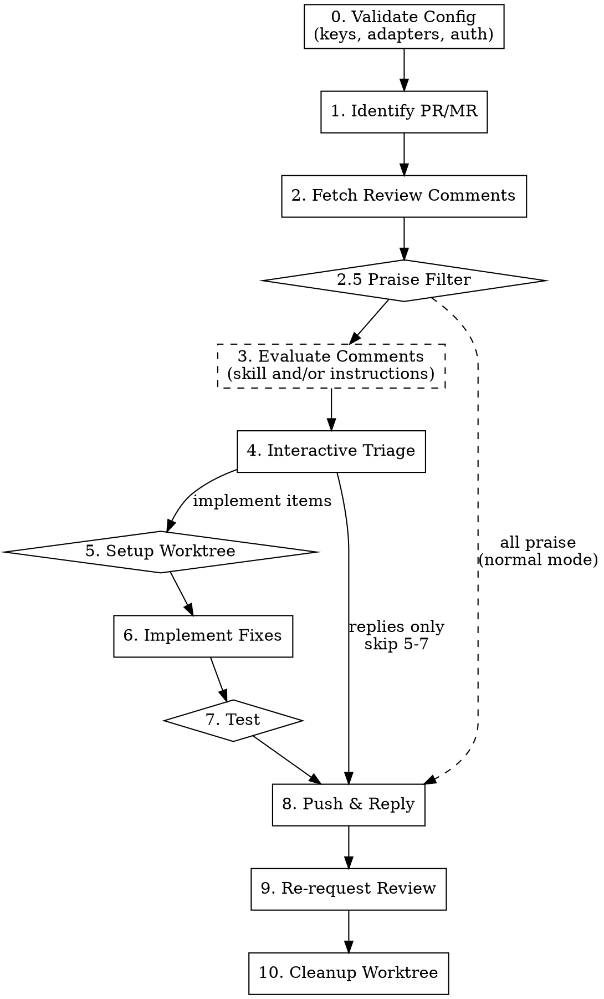

# flowyeah:respond — PR/MR Review Response Pipeline

Addresses review feedback on a pull request or merge request. Fetches unresolved comments, evaluates them via a configurable skill, presents them for interactive triage, implements approved fixes, replies to comment threads, resolves conversations, and conditionally re-requests review.

With `--own`, the source of items swaps from unresolved PR comments to findings produced by `/flowyeah:review --own [N]`. The pipeline reads `.flowyeah/review-approved-{N}.md`, runs the same evaluation + triage + implement flow, and closes the review round by setting `Phase: Responded` on the review session. No thread replies, resolves, or re-requests are sent because the findings were never public. Multiple rounds of `review --own` → `respond --own` can iterate on the same PR without explicit finalization between rounds.

Completes the PR lifecycle: `build` creates PRs, `review` evaluates them, `respond` addresses feedback.

```
flowyeah:respond [--own] [<number>]
```

## Invariant: Primary Checkout Is Untouched

The respond pipeline must not mutate the working tree, the index, or HEAD of the checkout it was invoked from (the "primary checkout"). All code mutation belongs inside the worktree created (or reused) at step 5 — `.flowyeah/worktrees/<branch>/`. Forbidden in the primary checkout, at every phase: `git checkout`, `git checkout-index`, `git restore`, `git switch`, `git reset`, `git apply`, `git am`, `git merge`, `git rebase`, `git pull`, `git stash`, `git clean`. `git fetch` (refs only, no working-tree side effects) is allowed.

This applies through the full lifecycle: steps 0-4 (config, identify, fetch, evaluate, triage) need only read-only operations against the primary checkout; steps 5-7 (worktree setup, implement, test) operate exclusively inside the worktree (`cd` into it before any code edit); steps 8-10 (push, re-request, cleanup) push from the worktree and remove it without touching the primary.

Default to read-only commands when gathering context — they cover everything the pipeline needs in steps 0-4:

| Need | Command |
|------|---------|
| PR comments / threads / state | Respond adapter API (`gh api`, GitLab REST) |
| File content at any SHA | `git show <sha>:<file>` |
| Per-line authorship at a SHA | `git blame <sha> -- <file>` |
| File history | `git log --oneline -10 <file>` |

The `tree-guard.sh` PreToolUse hook enforces this rule on Bash. If it blocks a command, do not retry, escalate, or work around it — either move into `.flowyeah/worktrees/<branch>/` (after step 5) or stop and ask Rodrigo. Edit/Write tool calls are not currently hook-gated, so the agent must hold the rule deliberately for those: never edit project files outside the worktree.

`finalize`-style cleanup is not a separate command for respond; the pipeline self-cleans at step 10. To abort mid-pipeline, remove `.flowyeah/respond-state-{N}.md` and `.flowyeah/respond-decisions-{N}.md` manually (or use `/flowyeah:status clean`).

## Argument Parsing

The `--own` flag may appear in any position. The positional argument (if present) is the PR number; otherwise auto-detect from the current branch via the respond adapter.

In `--own` mode:
- Platform-specific fetch (step 2 normal path) is replaced by reading the findings file.
- Thread reply, thread resolve, and re-request-review steps are skipped (no public threads exist for self-findings).
- Cleanup marks the linked review session as `Phase: Responded` instead of leaving it alone.

## Pipeline



If triage yields only replies (no code changes), skip steps 5-7 and go directly to step 8.

## Configuration

Uses `flowyeah.yml` from the project root (see `config-schema.md` at the plugin root for full schema and defaults). **If missing, load `setup.md` from the plugin root and follow its interactive setup instructions before proceeding.**

The respond skill uses:

| Key | Purpose |
|-----|---------|
| `git_host` | Determines respond adapter |
| `code_review.evaluation_skill` | Skill invoked to evaluate each comment — the *how* (optional) |
| `code_review.instructions` | Project-specific guidelines fed into comment evaluation — the *what* (optional) |
| `testing.command` | Shell command to run tests |
| `testing.scope` | `related` or `full` — scope for test runs |
| `commits.writer` | Agent or `null` for commit messages |
| `worktree.symlinks` | Paths symlinked from worktree to main checkout |
| `worktree.env` | Environment variables for worktree |
| `language` | Language for thread replies |

## Platform Detection

The respond adapter is determined from `git_host` in `flowyeah.yml`:

| `git_host` | Respond adapter |
|------------|-----------------|
| `github` | `adapters/github/respond.md` |
| `gitlab` | `adapters/gitlab/respond.md` |

Load the respond adapter once at the start. **If the git host adapter has no `respond.md`, STOP** — that adapter doesn't support review responses. All platform-specific operations (fetch comments, reply, resolve, re-request) go through the adapter.

## Session (Lightweight)

Create `.flowyeah/respond-state-{N}.md` for compaction resilience:

```markdown
# Current State

Type: respond
Status: Responding
PR/MR: <number>
Branch: <source_branch>
Platform: <adapter>
Comments: <count> total
Phase: <current_phase>
Worktree: <relative path under .flowyeah/worktrees/<branch>/ or "none">
WorktreeOwned: <true if respond created it, false if reused from a build session>
```

`Worktree` defaults to `none` and is set by step 5 when the worktree is resolved (created or reused). `WorktreeOwned` records whether respond created the worktree itself — only owned worktrees are torn down in step 10 (normal mode); reused build worktrees are left alone. Both fields are cleared back to `none`/`false` once cleanup completes. The hook injects them as-is on every prompt so context recovery can verify worktree state.

**Valid `Phase` values** (map to steps, used for crash recovery):

| Phase | Step | Recovery action |
|-------|------|-----------------|
| `Validating Config` | 0 | Re-run from start |
| `Identifying PR` | 1 | Re-run from start |
| `Fetching Comments` | 2 | Re-run from step 2 |
| `Evaluating` | 3 | Re-run from step 2 (comments lost) |
| `Interactive Triage` | 4 | Read `respond-decisions-{N}.md`, re-present any finding without a recorded decision. Decisions already recorded (including `Final critique:`) are preserved. |
| `Setting Up Worktree` | 5 | Read `respond-decisions-{N}.md`, retry worktree setup |
| `Implementing` | 6 | Read `respond-decisions-{N}.md`. For each `Action: implement` entry, check `git log` in the worktree for a commit whose subject references the finding (file + subject). Resume from the first implement decision with no corresponding commit. Re-apply the re-surface safety net on remaining pending decisions. |
| `Testing` | 7 | Re-run tests |
| `Pushing & Replying` | 8 | Check which threads already have replies, continue with remaining |
| `Re-requesting Review` | 9 | Check if re-request was sent, retry if not |
| `Cleaning Up Worktree` | 10 | In `--own` mode, check `review-state-{N}.md`'s phase — if not yet `Responded`, re-apply step 10. In normal mode, check if the worktree still exists and retry removal. Always verify respond state files are gone before declaring the session clean. |

After the user makes triage decisions (step 4), persist results to `.flowyeah/respond-decisions-{N}.md`:

```markdown
# Triage Decisions

## Comment 1
- Thread: <thread_id>
- File: app/services/payment_service.rb:42
- Action: implement
- Final critique:
    Assessment: agree
    Reasoning: null pointer possible when OAuth skips email scope
    Recommendation: implement

## Comment 2
- Thread: <thread_id>
- File: (general)
- Action: reject
- Final critique:
    Assessment: disagree
    Reasoning: single implementation, YAGNI applies
    Recommendation: reject

## Comment 3
- Thread: <thread_id>
- File: app/controllers/api/v1/payments_controller.rb:18
- Action: discuss
- Reply: Good point, but the validation happens upstream in the service layer — see PaymentValidator#call
- Final critique:
    Assessment: needs-clarification
    Reasoning: behaviour depends on which layer owns validation
    Recommendation: discuss
```

This file ensures that if compaction or a crash interrupts after triage, decisions are recoverable.

Respond sessions use `respond-state-{N}.md` (not `state.md`) so they never interfere with build sessions in worktrees. Respond and build sessions can coexist (different PRs). Respond and review sessions should not coexist for the same PR.

Update `respond-state-{N}.md` after each phase transition. The hook injection ensures state survives compaction.

Both `respond-state-{N}.md` and `respond-decisions-{N}.md` are removed in step 10 (cleanup).

### Cross-Round Persistence: `own-rejections-{N}.md`

Only used in `--own` mode. This file is **long-lived** — it survives across `review --own` / `respond --own` rounds and is removed only by `/flowyeah:review finalize {N}`. Its purpose: record findings the author rejected with reasoning so the next round's review agents do not re-flag the same concerns.

Path: `.flowyeah/own-rejections-{N}.md` (at the main checkout, never inside a worktree).

Schema:

```markdown
# Previously Rejected Findings (PR #{N})

## Rejection 1
- File: app/services/foo.rb:42
- Label: issue
- Subject: Missing null check on user.email
- Rejected at: 2026-05-04T15:30:00Z
- Reasoning: |
    Field is non-nullable at the DB level (see schema.rb).
    The agent did not account for the migration in commit abc1234.

## Rejection 2
- File: (general)
- Label: suggestion
- Subject: Extract validation into a service object
- Rejected at: 2026-05-04T18:12:00Z
- Reasoning: |
    YAGNI — single call site, premature abstraction.
```

**Field semantics:**

| Field | Required | Source |
|-------|----------|--------|
| `File:` | yes | Copied from the matching entry in `respond-decisions-{N}.md`. Use `(general)` for findings without `file:line`. |
| `Label:` | yes | Conventional Comments label from the original finding, with decorations preserved (e.g., `issue (blocking)`, `suggestion (non-blocking)`). Mirrors the format used in `review-approved-{N}.md` and `respond-decisions-{N}.md`. |
| `Subject:` | yes | The first non-empty line of the original finding body, stripped of label prefix. Used as the dedup key together with `File:`. |
| `Rejected at:` | yes | ISO 8601 UTC timestamp at the moment cleanup ran. |
| `Reasoning:` | yes | Multi-line block (literal `|` YAML scalar). Copied from the `Final critique:` block of the matching `respond-decisions-{N}.md` entry — specifically the `Reasoning:` sub-field. If the user rejected without discussion, the round-1 critique reasoning is what lands here. |

**Dedup key:** `(File, Subject)`. Two entries with the same key must not coexist; the later write replaces the earlier one (and updates `Rejected at:`).

**Lifecycle:** `own-rejections-{N}.md` is written by `respond --own` step 10, read by `review --own` step 2.8a, and removed by `review finalize {N}`.
Specifically, `own-rejections-{N}.md` is NOT removed by `respond --own` cleanup — only `respond-decisions-{N}.md` and `respond-state-{N}.md` are.

## Steps

### 0. Validate Configuration

Before starting, validate the loaded `flowyeah.yml`:

1. **Load schema:** read `config-schema.md` from the plugin root.
2. **Check required keys:** `git_host` must point to an adapter with `respond.md`.
3. **Check evaluation skill:** if `code_review.evaluation_skill` is present, verify the skill exists. If missing, **warn** (don't block) — proceed without it in step 3.
4. **Load review instructions:** if `code_review.instructions` is present, validate the path is relative and the file exists (per validation rules in `config-schema.md`). Read the file contents once and carry them through the pipeline. If missing or invalid, **error** (block) — this matches review's handling.
5. **Run validation rules:** execute relevant checks from the "Validation Rules" section of the schema.
6. **Detect legacy state files:** if `.flowyeah/respond-state.md` (without a PR number) exists, STOP with: *"Found legacy `.flowyeah/respond-state.md` — this file format is no longer supported. Remove it manually with `rm .flowyeah/respond-state.md .flowyeah/respond-decisions.md 2>/dev/null` and re-run."* Do not attempt to migrate.
7. **Auth verification:** verify credentials for the git host adapter.
8. **Report all issues at once** — collect validation failures and present together.

If validation fails, STOP with actionable error messages.

### 1. Identify PR/MR

If `<number>` is provided, use it. Otherwise, detect from current branch via the respond adapter.

Display PR/MR summary: title, author, branch, review state.

### 1.5 `--own` Mode Preflight

**Skip this section if `--own` was not provided.**

Before proceeding, verify all of the following. Report every failure as STOP with the indicated message:

1. **Main checkout only:** if `git rev-parse --show-toplevel` contains `.flowyeah/worktrees/`, STOP: *"respond --own must start from the main checkout, not from inside a worktree."*
2. **Review session exists for this PR:** require `.flowyeah/review-state-{N}.md` to exist. If missing, STOP: *"No review session for PR #{N}. Run `/flowyeah:review --own {N}` first."*
3. **Review phase is Delegated:** parse the `Phase:` line from `review-state-{N}.md`.
   - If `Phase: Responded`, STOP: *"Previous round complete. Run `/flowyeah:review --own {N}` for a new round."*
   - If `Phase: Findings Delivered`, STOP: *"Review pipeline is still at the Next Action menu — return to that session and pick `Delegate`."*
   - If any other phase, STOP: *"Review for PR #{N} is mid-pipeline (Phase: X). Finalize or resume the review session first."*
4. **Findings file present:** require `.flowyeah/review-approved-{N}.md` to exist and contain at least one `## Finding ` heading. If missing or empty, STOP: *"No approved findings for PR #{N}. Run `/flowyeah:review finalize {N}` and start over."*
5. **Worktree exists for branch:** parse `Branch:` from `review-state-{N}.md`. Verify a directory exists under `.flowyeah/worktrees/` for that branch. If not, STOP: *"No worktree for branch `X`. Run `/flowyeah:build` first to create one."*

On success, echo: *"Responding to <count> findings from PR #{N}."*

### 2. Fetch Review Comments

**If `--own` mode:** skip the adapter fetch. Read `.flowyeah/review-approved-{N}.md` and construct synthetic comments from it using this mapping:

| respond field | `--own` value |
|---|---|
| Reviewer name | `self (review --own)` |
| Comment body | the Conventional Comments block from the finding (`**label (decoration):** subject` plus body) |
| File path + line | from the finding's `- File:` line |
| Thread ID | synthetic: `own-{N}-{index}` where index is 1-based position in the file |
| Review state | `SELF_REVIEW` |
| Conventional parse | already in format — direct parse |

Group by reviewer is trivial (all `self`). If no findings are parseable, STOP: *"review-approved-{N}.md exists but contains no parseable findings — cannot proceed."*

If zero synthetic comments result, the subsequent steps have nothing to do — report "No findings to respond to" and exit cleanly (do not mark Phase: Responded).

**Normal mode** (no `--own`): continue with the existing adapter fetch below.

Via the respond adapter, fetch all unresolved review comments/threads. For each comment capture:

- Reviewer name
- Comment body (raw text)
- File path + line (if inline)
- Thread ID (for replying/resolving)
- Conventional Comment parsed fields (if format matches)
- Review state of reviewer's most recent review

Group comments by reviewer.

**Conventional Comments parsing:** when a comment's body matches the `**<label> [decorations]:** <subject>` format, parse the label, decorations, and subject. Treat non-matching comments as free-form — they are equally valid.

If no unresolved comments found, report and exit cleanly.

### 2.5 Praise Filter

Conventional Comments items with label `praise` are not actionable feedback — they recognize good work. Routing them through the per-finding `[d]/[i]/[r]` triage adds friction without value, so they are auto-handled before evaluation.

After step 2, partition the comment list into two groups:

- **Praise** — Conventional Comments parse succeeded and `label == "praise"` (decorations such as `(non-blocking)` are ignored for matching).
- **Actionable** — everything else: other labels, free-form text, or parse failures. Hedged positives without the `praise` label (e.g., "looks good?") stay actionable on purpose — they may be questions in disguise.

For each praise item, upsert a decision into `.flowyeah/respond-decisions-{N}.md` with `Action: praise-ack`. Do not invoke `evaluation_skill` and do not surface these in step 4. Pass only the actionable group forward to step 3.

**Schema — normal mode** (write a short `Reply:` in the language configured in `language`; the agent picks something context-appropriate, a one-line thanks is fine, echoing what the reviewer called out is better when it reads naturally):

```markdown
## Comment 4
- Thread: <thread_id>
- File: app/models/payment.rb:80
- Action: praise-ack
- Reply: Valeu! Esse refactor estava encostado há tempos.
```

**Schema — `--own` mode** (omit `Reply:` entirely — the synthetic thread has no platform-side reply target):

```markdown
## Finding 4
- Thread: own-{N}-4
- File: app/models/payment.rb:80
- Action: praise-ack
```

**Downstream handling:**

| Mode | Step 8 | Step 9 | Step 10 |
|------|--------|--------|---------|
| Normal | Post `Reply` to the thread, then resolve it. Reply-only action — counts toward the "replies only" path for re-request gating. | Treated like any reply-only thread. | No special handling. |
| `--own` | Skipped — synthetic thread has no platform counterpart. | Skipped (whole step). | Not persisted to `own-rejections-{N}.md` (praise is not a rejection). |

**Short-circuit:** if the actionable group is empty (every comment was praise), skip steps 3-7 entirely. In normal mode, go directly to step 8 to post the auto-thanks and resolve. In `--own` mode, report "Only praise — nothing to respond to." and skip to step 10.

### 3. Evaluate Comments

Operates only on the actionable group from step 2.5 — praise has already been routed.

**Skip only if neither `code_review.evaluation_skill` nor `code_review.instructions` is configured** — present comments raw without recommendations in step 4.

The plug that runs depends on what is configured (`evaluation_skill` is the *how* — general method; `code_review.instructions` is the *what* — project specifics):

- **Both configured:** invoke `evaluation_skill` via the Skill tool, passing the instructions contents as additional project context.
- **Instructions only (no skill):** evaluate each comment inline against the instructions — mirroring how `review` runs "Project Review Guidelines" as a direct inline check (`review/SKILL.md`, step 3b).
- **Skill only:** invoke `evaluation_skill` via the Skill tool with no project instructions.

When instructions are present in either branch, **act** on them — do not treat them as passive text. Instructions may reference external resources (a Linear issue and sub-issue, a docs URL); resolve those using available tools (Linear access, WebFetch) to verify compliance. If a referenced resource cannot be fetched, degrade gracefully: mark that finding's assessment `unavailable` with the reason (see per-finding errors below) rather than implying compliance that was not verified.

This step runs identically in `--own` mode: the synthetic comments built during self-audit flow through the same branches.

In every branch, for each comment produce:

- **Assessment**: agree / disagree / needs-clarification
- **Reasoning**: brief technical justification (verified against codebase)
- **Recommended action**: implement / reject / discuss

**Per-finding evaluation errors:** if evaluation fails for a specific comment/finding — an `evaluation_skill` error (timeout, exception, malformed output) **or** a failure resolving an external resource referenced by `code_review.instructions` (unreachable issue, failed fetch) — do not abort the entire run. Instead, mark that finding's critique as unavailable and proceed. In step 4, the per-finding UX shows:

```
┌─ Critique ───────────────────────────────────────────────
│ Assessment:  unavailable (evaluation skill error)
│ Reasoning:   <error message or "evaluation skipped">
│ Recommended: —
└─────────────────────────────────────────────────────────
```

The `[d]iscuss` option is still available — a discussion round may succeed where the initial evaluation didn't. The `[i]` and `[r]` options use pure human judgment.

### 4. Interactive Triage (per-finding discussion loop)

Present findings from the step 2.5 actionable group one at a time (praise-ack items are never triaged). For each, show the finding plus its round-1 critique (from step 3), then enter a loop until the user decides. No code is modified in this step — all decisions are recorded and implementation happens in batch during step 6.

**MANDATORY: one finding per prompt.** Do not collapse multiple findings into a single review memo, table, or batch approval form. Each finding gets its own prompt with its own `[d]/[i]/[r]` action. Persist the decision, then advance to the next finding.

#### Anti-pattern (do not do this)

```
✗ WRONG — batch triage memo

Triage — 6 findings from review --own #8880

  Finding 1 · nitpick · in-scope-now
  File: …
  - Assessment: agree
  - Recommendation: implement

  Finding 2 · nitpick · in-scope-now
  …

Proposed triage: implement 1, 2, 3 · reject 4, 5, 6.
Confirmar com ok, ou d 3 / r 2 para alterar.
```

This shape is forbidden because it:
- Drops the **Finding Card** format (no `═══` header, no `┌─│└` comment box), collapsing each finding into a one-line header — the "wall of text" the card exists to prevent.
- Skips the per-finding discussion loop (no `[d]` round possible on one finding in isolation).
- Invents a `d 3` / `r 2` syntax that is not in the skill.
- Defers persistence — decisions only hit `respond-decisions-{N}.md` after bulk confirm, so a compaction mid-memo loses everything.
- Merges step 3 (evaluation output) and step 4 (interactive triage) into a single blob.

#### Per-finding UX

For each item `i` in order (severity → confidence, as delivered by the evaluation in step 3), render the **Finding Card** — the same canonical `═══` header and `┌─│└` comment box used by `flowyeah:review` (keep the two skills in sync) — followed by a boxed critique block and the action menu:

```
═══════════════════════════════════════════════════════════
Finding i of N
═══════════════════════════════════════════════════════════
Label:      <label> (<decoration>)
Confidence: <0-100>/100
File:       <path>:<line>
Source:     <comment author / own review>

┌─────────────────────────────────────────────────────────
│ **<label> (<decoration>):** <subject>
│
│ <body>
└─────────────────────────────────────────────────────────

┌─ Critique (round 1) ─────────────────────────────────────
│ Assessment:  <agree | disagree | needs-clarification>
│ Reasoning:   <evaluation_skill's reasoning from step 3>
│ Recommended: <implement | reject | discuss>
└─────────────────────────────────────────────────────────

[d]iscuss  [i]mplement  [r]eject
>
```

Accept a single-letter action:

- **`d` — discuss:** prompt the user for a follow-up question, then dispatch an additional `evaluation_skill` round with the extended-contract input (see below). Display the revised critique. Stay in the loop, re-showing the `[d] [i] [r]` menu.
- **`i` — implement:** record the decision, move to the next finding. Do not modify code.
- **`r` — reject:** record the decision, move to the next finding.

In normal (non-`--own`) mode, the menu also shows `[s]` (discuss-with-reviewer: reply to the reviewer and mark for thread reply in step 8). In `--own` mode, only `[d] [i] [r]` are offered — there is no reviewer to reply to.

#### Example discuss round

```
> d
Your counter or question:
> Check the actual isolation level — my Rails config should be READ COMMITTED.

[critique round 2...]

┌─ Critique (round 2) ─────────────────────────────────────
│ Assessment:  agree (revised)
│ Reasoning:   config/initializers/database.rb:14 sets
│              :read_committed. The race is real.
│ Recommended: implement
└─────────────────────────────────────────────────────────

[d]iscuss  [i]mplement  [r]eject
>
```

#### `evaluation_skill` contract (extended)

`evaluation_skill` is invoked twice in this skill:
1. **Step 3** (initial critique, once per finding): input `{ finding }`, output `{ assessment, reasoning, recommendation }`. This is the existing contract.
2. **Step 4** (discussion rounds, on-demand): input `{ finding, prior_rounds, user_question }` where `prior_rounds` is an ordered list of `{ assessment, reasoning, recommendation, user_question? }` entries (round 1 has no `user_question`). Output is the same shape: `{ assessment, reasoning, recommendation }`.

**Backward compatibility:** skills that only implement the round-1 contract still work — for discussion rounds, fall back to calling the skill with `{ finding }` augmented with a prose preamble summarizing prior rounds and the user's question. The result is lower-quality but functional.

#### Persistence

After every decision (implement/reject), upsert an entry for that finding in `.flowyeah/respond-decisions-{N}.md` — write the block if it doesn't exist, or replace the existing block for that finding. Mid-discussion (before a terminal `[i]` or `[r]`), no persistence happens: decisions are only recorded when the user commits to a terminal action. Schema:

```markdown
# Triage Decisions

## Finding 1
- Thread: own-{N}-1
- File: app/models/payment.rb:42
- Action: implement
- Final critique:
    Assessment: agree (after round 2 discussion)
    Reasoning: race is real under READ COMMITTED isolation
    Recommendation: implement

## Finding 2
- Thread: own-{N}-2
- File: (general)
- Action: reject
- Final critique:
    Assessment: disagree
    Reasoning: single implementation, YAGNI applies
    Recommendation: reject

## Comment 3
- Thread: <thread_id>
- File: app/controllers/api/v1/payments_controller.rb:18
- Action: discuss
- Reply: Validation lives upstream in PaymentValidator#call — see service layer
- Final critique:
    Assessment: needs-clarification
    Reasoning: behaviour depends on which layer owns validation
    Recommendation: discuss
```

For normal-mode respond, `Thread:` uses the platform's real thread ID and headings use `## Comment` instead of `## Finding`. The `Final critique:` block is new in both modes and stores the **last** round's assessment (after any discussion). If the user rejects without discussing, `Final critique:` mirrors the round-1 critique. The `[s]` path (normal mode only, see Per-finding UX) produces `Action: discuss` plus a `Reply:` field capturing the user's reply to post at step 8.

#### Termination

When all findings have a decision, exit the loop. Display a one-line summary:

```
Triage complete: <implement_count> implement, <reject_count> reject.
```

Proceed to step 5 (setup worktree) if any decisions are `implement`. Otherwise, in `--own` mode, stop here with "No findings to implement — review round closed." and proceed directly to step 10 (cleanup). In normal mode, proceed to step 8 (push & reply) to post replies for rejected items and for `[s]`-path discussion replies.

### 5. Setup Worktree

**Only if there are items marked "implement."** If all items are "reject" or "discuss", skip to step 8.

Check if a worktree for the PR branch already exists:

1. Scan `.flowyeah/worktrees/` for a directory matching the branch name
2. Scan `.worktrees/` for the same

If found, reuse the existing worktree. Otherwise, create one:

```bash
git worktree add .flowyeah/worktrees/<branch> <branch>
```

Then follow the **Setup** procedure from `worktree-lifecycle.md` (at the plugin root):

1. **Symlinks** — resolve `worktree.symlinks` from `flowyeah.yml`
2. **Environment** — resolve `worktree.env`, persist to `respond-state-{N}.md` under `## Worktree Env`, export, run `worktree.setup` commands

Track whether the worktree was **created** by this respond session (vs. reused from a build session) — only cleanup worktrees that respond created.

### 6. Implement Fixes

Navigate to the worktree. Read `.flowyeah/respond-decisions-{N}.md` (main checkout path) into memory — it contains all triage decisions including `Final critique:` blocks.

For each decision with `Action: implement`, in the order they appear:

1. **Read context:** file, surrounding lines, related code paths identified by the final critique.
2. **Make the change** informed by the `Final critique:` reasoning — not just the finding's raw body. The critique may have been revised through discussion and reflects the user's latest understanding.
3. **Commit** using `commits.writer` from config. Commit message should reference the finding (file + subject). One commit per implemented decision is the default.

**Grouping:** when the decisions already queued for implementation naturally touch the same file or the same concern, you may group them into a single commit. Do not force grouping if it obscures intent. One-commit-per-finding is always acceptable.

#### Re-surface on conflict (safety net)

After each commit, before moving to the next implement decision, scan the remaining pending implement decisions and check for potential invalidation:

```
for later_decision in remaining_pending_implement_decisions:
    if later_decision.file == current_decision.file
       and abs(later_decision.line - current_decision.line) <= 20:
        PAUSE and present to user:
          "Fix for finding <i> changed <file> near line <line>.
           Finding <j> was also in this region (line <j_line>).
           Does its decision still hold?
           [k]eep decision  [r]e-open discussion  [s]kip finding <j>"
```

User responses:
- **`k`** — keep the existing decision, continue.
- **`r`** — re-open the discussion loop from step 4 for just that finding, then update the decision. Resume implementation from the next pending decision.
- **`s`** — change finding `<j>`'s action to `reject` and record the reason ("skipped after re-surface: superseded by finding <i>'s fix"). Continue.

The 20-line proximity window is a heuristic. Cross-file refactors won't trigger the safety net — that's acceptable; the user can always interrupt the implementation manually if they notice a bigger landscape shift.

#### After all implement decisions are done

Proceed to step 7 (Test). Do not push yet.

### 7. Test (if code changed)

**Only if code was changed in step 6.**

Run tests using `testing.command` and `testing.scope` from config. If tests fail, **STOP** and report failures. Do not push or reply.

### 8. Push & Reply

**In `--own` mode:**
1. Push the branch as normal.
2. **Skip thread reply entirely** — there are no threads to reply to.
3. **Skip thread resolve entirely** — there are no threads to resolve.

**In normal mode:**
1. **Push the branch** (from the worktree, if one was used)
2. **Reply to each comment thread** via the respond adapter:
   - **Implemented:** describe what was done (e.g., "Fixed — added guard clause for nil `user.email`")
   - **Rejected:** provide technical reasoning (e.g., "Single implementation — applying YAGNI here. The factory pattern would add indirection without a second consumer.")
   - **Discuss:** post the user's reply text
   - **Praise-ack (auto):** post the `Reply` recorded at step 2.5 verbatim — do not rewrite it here
3. **Resolve each thread after replying**

### 9. Re-request Review

**In `--own` mode, skip this step entirely** — there are no external reviewers to re-request from. Proceed directly to step 10.

Re-request behavior depends on whether code was changed (steps 5-7 executed) or only replies were posted (skipped to step 8).

#### When code was changed (push happened)

Pushing new commits dismisses existing approvals (standard GitHub branch protection behavior). Re-request from **all** reviewers and notify previously-approved reviewers.

**GitHub:**

| State | Re-request? | Reason |
|-------|-------------|--------|
| `CHANGES_REQUESTED` | Yes | Reviewer blocked the PR and needs to re-evaluate |
| `COMMENTED` | Yes | Reviewer left feedback and should see the response |
| `APPROVED` | Yes | Approval was dismissed by the new push — needs re-approval |
| `DISMISSED` | No | Review was dismissed before this cycle |

**Post a PR comment** (not a thread reply) notifying previously-approved reviewers that their approval was dismissed. Mention them by username so they get a notification:

```
@reviewer1 @reviewer2 — o push de correções invalidou a aprovação anterior.
Podem re-aprovar quando conveniente? As mudanças foram: <brief summary of what changed>.
```

Write the comment in the language configured in `language` from `flowyeah.yml`.

#### When no code was changed (replies only)

No push happened, so approvals remain intact. Only re-request from reviewers with pending feedback.

**GitHub:**

| State | Re-request? | Reason |
|-------|-------------|--------|
| `CHANGES_REQUESTED` | Yes | Reviewer blocked the PR and needs to re-evaluate |
| `COMMENTED` | Yes | Reviewer left feedback and should see the response |
| `APPROVED` | No | Approval still valid — no code changed |
| `DISMISSED` | No | Review was dismissed |

**GitLab:** use presence of unresolved threads as proxy (GitLab lacks a `CHANGES_REQUESTED` state). After resolving all threads from a reviewer, re-add that reviewer to the reviewers list. When code was changed, re-add all previous reviewers.

Via the respond adapter.

### 10. Cleanup

Cleanup has two paths depending on mode.

#### `--own` mode

Do **not** remove the worktree — it's owned by `build`. Specifically:

1. **Update the review session state:** rewrite `.flowyeah/review-state-{N}.md` (at the main checkout path) so that `Phase:` is `Responded`. Leave all other fields intact. Touch the file's mtime.
2. **Persist cross-round rejections:** read `.flowyeah/respond-decisions-{N}.md` and update `.flowyeah/own-rejections-{N}.md` per the rules below. Create the rejections file (with header `# Previously Rejected Findings (PR #{N})` and a single trailing blank line) if it does not exist. The rules:
   - For each `## Finding K` block in `respond-decisions-{N}.md` with `Action: reject` — upsert a `## Rejection M` block into `own-rejections-{N}.md`. The dedup key is `(File, Subject)`. If a matching entry exists, replace it: overwrite all fields (`File`, `Label`, `Subject`, `Reasoning`) with the new values derived from the matching `respond-decisions-{N}.md` entry, and set `Rejected at:` to the current timestamp. Otherwise append a new entry. `M` is the next available 1-based index after the highest existing `## Rejection` heading. (Indices are never reused after deletion; gaps in the sequence are expected and benign.) See the schema in the "Cross-Round Persistence" section above for field mapping.
   - For each `## Finding K` block with `Action: implement` — if a matching entry exists in `own-rejections-{N}.md` (same `File:` and `Subject:`), remove it. The user has overridden their previous rejection by choosing to fix the issue this round; the rejection no longer applies. If no match exists, do nothing.
   - `Action: discuss` blocks (only present in normal mode) and `Action: praise-ack` blocks are ignored — neither represents a rejection. Same for any other action value.
   - If after all updates `own-rejections-{N}.md` contains no `## Rejection ` headings (regardless of whether the `# Previously Rejected Findings` header line is present), delete the file. A header-only file is noise.
3. **Remove the findings file:** `rm .flowyeah/review-approved-{N}.md` (findings are consumed).
4. **Remove respond state files:** `rm .flowyeah/respond-state-{N}.md .flowyeah/respond-decisions-{N}.md`. Do **not** touch `own-rejections-{N}.md` here — it persists across rounds.
5. **Do not touch** `.flowyeah/worktrees/...` or any files inside the worktree.

Display the end-of-round guidance:

```
Round complete. Next options:
  /flowyeah:review --own {N}       — start another review round
  /flowyeah:review finalize {N}    — close out the review relationship (when done)
```

#### Normal mode (worktree created by this respond session)

Follow the **Teardown** procedure from `worktree-lifecycle.md` (at the plugin root):

1. **Close IDE windows** — prevent VSCode from freezing
2. **Run teardown commands** — read env from `respond-state-{N}.md ## Worktree Env`, export, run `worktree.teardown`
3. **Remove worktree** — `git worktree remove`

Then remove session files (`respond-state-{N}.md` and `respond-decisions-{N}.md`).

#### Normal mode (worktree was reused from a build session)

Skip worktree removal. Remove session files (`respond-state-{N}.md` and `respond-decisions-{N}.md`) only.

## Crash Recovery

If a respond session is interrupted (compaction, crash, user abort):

1. The hook injects `respond-state-{N}.md` into the next prompt
2. Resume from the last recorded phase using the recovery table above
3. If the phase was before "Interactive Triage" (step 4), re-run from that phase
4. If during or after triage, read `respond-decisions-{N}.md` to recover previously made decisions
5. If all replies were already posted and review re-requested, clean up both state files

## Comment Language

Thread replies are written in the language configured in `language` from `flowyeah.yml`. Default: `en`.

## Error Handling

| Error | Action |
|-------|--------|
| PR/MR not found | Ask user for number/URL |
| No unresolved comments | Report and exit cleanly |
| Evaluation skill not found | Warn, proceed without evaluation |
| Worktree creation fails | Report error, suggest manual resolution |
| Tests fail | Stop, report failures, don't push |
| Reply fails (401, 403, 429, 5xx) | Retry up to 2 times, then STOP and report |
| Thread resolve fails | Log warning, continue (non-critical) |
| Re-request review fails | Log warning, continue (non-critical) |

## Timing

After all steps complete (or on early exit), display a summary:

```
Respond complete — N items (M implemented, K rejected, J discussed, P praise auto-acked)
  Code changes: yes/no | Tests: passed/skipped
  In --own mode: review round closed, Phase: Responded
  In normal mode: Re-request review: yes (2 reviewers) / no
```

Omit the `P praise auto-acked` field when `P == 0`.

## Never

- Push without running tests (when code was changed)
- Reply to comments the user skipped
- Resolve threads without replying first
- Skip the triage step for actionable findings (praise-ack at step 2.5 is the only sanctioned exception)
- Present findings as a batch summary, table, or triage memo — step 4 is one finding per prompt, single-letter action, persist, advance (see §4 anti-pattern)
- Route a non-`praise` comment through the auto-ack path (free-form positives without a `praise` label go through normal triage)
- Implement without user approval
- Re-request review from `DISMISSED` reviewers (GitHub)
- Re-request review from `APPROVED` reviewers when no code was changed (GitHub)
- Modify code outside the worktree (see "Invariant: Primary Checkout Is Untouched"). The pre-tool-use hook `tree-guard.sh` blocks tree-mutating git commands in the primary checkout while a respond session is active for the current branch. If it blocks a command, do not retry, escalate, or work around it; either move into `.flowyeah/worktrees/<branch>/` or abort the session.
