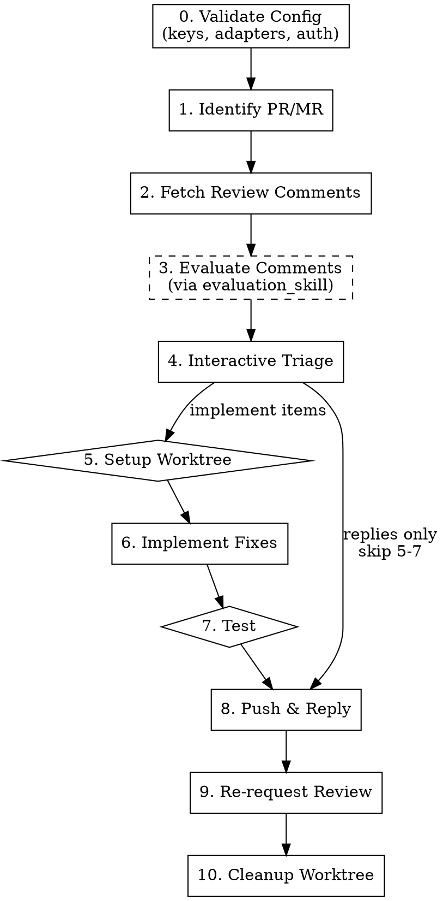

# flowyeah:respond — PR/MR Review Response Pipeline

Addresses review feedback on a pull request or merge request. Fetches unresolved comments, evaluates them via a configurable skill, presents them for interactive triage, implements approved fixes, replies to comment threads, resolves conversations, and conditionally re-requests review.

Completes the PR lifecycle: `build` creates PRs, `review` evaluates them, `respond` addresses feedback.

```
flowyeah:respond [<number>]
```

## Pipeline



If triage yields only replies (no code changes), skip steps 5-7 and go directly to step 8.

## Configuration

Uses `flowyeah.yml` from the project root (see `config-schema.md` at the plugin root for full schema and defaults). **If missing, load `setup.md` from the plugin root and follow its interactive setup instructions before proceeding.**

The respond skill uses:

| Key | Purpose |
|-----|---------|
| `git_host` | Determines respond adapter |
| `code_review.evaluation_skill` | Skill invoked to evaluate each comment (optional) |
| `testing.command` | Shell command to run tests |
| `testing.scope` | `related` or `full` — scope for test runs |
| `commits.writer` | Agent or `null` for commit messages |
| `worktree.symlinks` | Paths symlinked from worktree to main checkout |
| `worktree.env` | Environment variables for worktree |
| `language` | Language for thread replies |

## Platform Detection

The respond adapter is determined from `git_host` in `flowyeah.yml`:

| `git_host` | Respond adapter |
|------------|-----------------|
| `github` | `adapters/github/respond.md` |
| `gitlab` | `adapters/gitlab/respond.md` |

Load the respond adapter once at the start. **If the git host adapter has no `respond.md`, STOP** — that adapter doesn't support review responses. All platform-specific operations (fetch comments, reply, resolve, re-request) go through the adapter.

## Session (Lightweight)

Create `.flowyeah/respond-state.md` for compaction resilience:

```markdown
# Current State

Type: respond
Status: Responding
PR/MR: <number>
Branch: <source_branch>
Platform: <adapter>
Comments: <count> total
Phase: <current_phase>
```

**Valid `Phase` values** (map to steps, used for crash recovery):

| Phase | Step | Recovery action |
|-------|------|-----------------|
| `Validating Config` | 0 | Re-run from start |
| `Identifying PR` | 1 | Re-run from start |
| `Fetching Comments` | 2 | Re-run from step 2 |
| `Evaluating` | 3 | Re-run from step 2 (comments lost) |
| `Interactive Triage` | 4 | Read `respond-decisions.md`, re-present undecided comments |
| `Setting Up Worktree` | 5 | Read `respond-decisions.md`, retry worktree setup |
| `Implementing` | 6 | Read `respond-decisions.md`, check git log for completed commits, continue with remaining items |
| `Testing` | 7 | Re-run tests |
| `Pushing & Replying` | 8 | Check which threads already have replies, continue with remaining |
| `Re-requesting Review` | 9 | Check if re-request was sent, retry if not |
| `Cleaning Up Worktree` | 10 | Check if worktree still exists, retry removal |

After the user makes triage decisions (step 4), persist results to `.flowyeah/respond-decisions.md`:

```markdown
# Triage Decisions

## Comment 1
- Thread: <thread_id>
- File: app/services/payment_service.rb:42
- Action: implement
- Note: Add null check guard

## Comment 2
- Thread: <thread_id>
- File: (general)
- Action: reject
- Reply: Single implementation, YAGNI applies

## Comment 3
- Thread: <thread_id>
- File: app/controllers/api/v1/payments_controller.rb:18
- Action: discuss
- Reply: Good point, but the validation happens upstream in the service layer — see PaymentValidator#call
```

This file ensures that if compaction or a crash interrupts after triage, decisions are recoverable.

Respond sessions use `respond-state.md` (not `state.md`) so they never interfere with build sessions in worktrees. Respond and build sessions can coexist (different PRs). Respond and review sessions should not coexist for the same PR.

Update `respond-state.md` after each phase transition. The hook injection ensures state survives compaction.

Both `respond-state.md` and `respond-decisions.md` are removed in step 10 (cleanup).

## Steps

### 0. Validate Configuration

Before starting, validate the loaded `flowyeah.yml`:

1. **Load schema:** read `config-schema.md` from the plugin root.
2. **Check required keys:** `git_host` must point to an adapter with `respond.md`.
3. **Check evaluation skill:** if `code_review.evaluation_skill` is present, verify the skill exists. If missing, **warn** (don't block) — proceed without evaluation in step 3.
4. **Run validation rules:** execute relevant checks from the "Validation Rules" section of the schema.
5. **Auth verification:** verify credentials for the git host adapter.
6. **Report all issues at once** — collect validation failures and present together.

If validation fails, STOP with actionable error messages.

### 1. Identify PR/MR

If `<number>` is provided, use it. Otherwise, detect from current branch via the respond adapter.

Display PR/MR summary: title, author, branch, review state.

### 2. Fetch Review Comments

Via the respond adapter, fetch all unresolved review comments/threads. For each comment capture:

- Reviewer name
- Comment body (raw text)
- File path + line (if inline)
- Thread ID (for replying/resolving)
- Conventional Comment parsed fields (if format matches)
- Review state of reviewer's most recent review

Group comments by reviewer.

**Conventional Comments parsing:** when a comment's body matches the `**<label> [decorations]:** <subject>` format, parse the label, decorations, and subject. Treat non-matching comments as free-form — they are equally valid.

If no unresolved comments found, report and exit cleanly.

### 3. Evaluate Comments

**Skip if `code_review.evaluation_skill` is not configured** — present comments raw without recommendations in step 4.

If configured, invoke the evaluation skill via the Skill tool. For each comment produce:

- **Assessment**: agree / disagree / needs-clarification
- **Reasoning**: brief technical justification (verified against codebase)
- **Recommended action**: implement / reject / discuss

### 4. Interactive Triage

Present all comments as a numbered list, grouped by reviewer. Show each reviewer's review state (e.g., `CHANGES_REQUESTED`, `COMMENTED`). Show evaluation assessment if available.

```
Comment 1 — @reviewer-name (CHANGES_REQUESTED)
File:        app/services/payment_service.rb:42
Comment:     "Missing null check on user.email"
Assessment:  Agree — user.email can be nil when OAuth skips email scope
Recommended: implement

Comment 2 — @reviewer-name (CHANGES_REQUESTED)
File:        (general)
Comment:     "Consider using a factory pattern here"
Assessment:  Disagree — single implementation, YAGNI applies
Recommended: reject

Comment 3 — @other-reviewer (COMMENTED)
File:        app/controllers/api/v1/payments_controller.rb:18
Comment:     "Should this validate the payment amount?"
Assessment:  (no evaluation skill configured)
```

User decides with batch input:

- `implement all` / `reject all`
- `implement 1,3 | reject 2 | discuss 4`
- For "discuss" items: prompt user for reply text

Persist decisions to `.flowyeah/respond-decisions.md`.

### 5. Setup Worktree

**Only if there are items marked "implement."** If all items are "reject" or "discuss", skip to step 8.

Check if a worktree for the PR branch already exists:

1. Scan `.flowyeah/worktrees/` for a directory matching the branch name
2. Scan `.worktrees/` for the same

If found, reuse the existing worktree. Otherwise, create one:

```bash
git worktree add .flowyeah/worktrees/<branch> <branch>
```

Then follow the **Setup** procedure from `worktree-lifecycle.md` (at the plugin root):

1. **Symlinks** — resolve `worktree.symlinks` from `flowyeah.yml`
2. **Environment** — resolve `worktree.env`, persist to `respond-state.md` under `## Worktree Env`, export, run `worktree.setup` commands

Track whether the worktree was **created** by this respond session (vs. reused from a build session) — only cleanup worktrees that respond created.

### 6. Implement Fixes

Navigate to the worktree. For each "implement" item:

1. Read relevant code context (file, surrounding lines, related code)
2. Make the change
3. Commit using `commits.writer` from config

**Grouping:** when multiple implement items touch the same file or the same concern, group them into a single commit.

### 7. Test (if code changed)

**Only if code was changed in step 6.**

Run tests using `testing.command` and `testing.scope` from config. If tests fail, **STOP** and report failures. Do not push or reply.

### 8. Push & Reply

1. **Push the branch** (from the worktree, if one was used)
2. **Reply to each comment thread** via the respond adapter:
   - **Implemented:** describe what was done (e.g., "Fixed — added guard clause for nil `user.email`")
   - **Rejected:** provide technical reasoning (e.g., "Single implementation — applying YAGNI here. The factory pattern would add indirection without a second consumer.")
   - **Discuss:** post the user's reply text
3. **Resolve each thread after replying**

### 9. Re-request Review

Re-request behavior depends on whether code was changed (steps 5-7 executed) or only replies were posted (skipped to step 8).

#### When code was changed (push happened)

Pushing new commits dismisses existing approvals (standard GitHub branch protection behavior). Re-request from **all** reviewers and notify previously-approved reviewers.

**GitHub:**

| State | Re-request? | Reason |
|-------|-------------|--------|
| `CHANGES_REQUESTED` | Yes | Reviewer blocked the PR and needs to re-evaluate |
| `COMMENTED` | Yes | Reviewer left feedback and should see the response |
| `APPROVED` | Yes | Approval was dismissed by the new push — needs re-approval |
| `DISMISSED` | No | Review was dismissed before this cycle |

**Post a PR comment** (not a thread reply) notifying previously-approved reviewers that their approval was dismissed. Mention them by username so they get a notification:

```
@reviewer1 @reviewer2 — o push de correções invalidou a aprovação anterior.
Podem re-aprovar quando conveniente? As mudanças foram: <brief summary of what changed>.
```

Write the comment in the language configured in `language` from `flowyeah.yml`.

#### When no code was changed (replies only)

No push happened, so approvals remain intact. Only re-request from reviewers with pending feedback.

**GitHub:**

| State | Re-request? | Reason |
|-------|-------------|--------|
| `CHANGES_REQUESTED` | Yes | Reviewer blocked the PR and needs to re-evaluate |
| `COMMENTED` | Yes | Reviewer left feedback and should see the response |
| `APPROVED` | No | Approval still valid — no code changed |
| `DISMISSED` | No | Review was dismissed |

**GitLab:** use presence of unresolved threads as proxy (GitLab lacks a `CHANGES_REQUESTED` state). After resolving all threads from a reviewer, re-add that reviewer to the reviewers list. When code was changed, re-add all previous reviewers.

Via the respond adapter.

### 10. Cleanup Worktree

**Only if a worktree was created by this respond session** (not reused from a build session). If no worktree was used (replies only), skip.

Follow the **Teardown** procedure from `worktree-lifecycle.md` (at the plugin root):

1. **Close IDE windows** — prevent VSCode from freezing
2. **Run teardown commands** — read env from `respond-state.md ## Worktree Env`, export, run `worktree.teardown`
3. **Remove worktree** — `git worktree remove`

Then remove session files (`respond-state.md` and `respond-decisions.md`).

## Crash Recovery

If a respond session is interrupted (compaction, crash, user abort):

1. The hook injects `respond-state.md` into the next prompt
2. Resume from the last recorded phase using the recovery table above
3. If the phase was before "Interactive Triage" (step 4), re-run from that phase
4. If during or after triage, read `respond-decisions.md` to recover previously made decisions
5. If all replies were already posted and review re-requested, clean up both state files

## Comment Language

Thread replies are written in the language configured in `language` from `flowyeah.yml`. Default: `en`.

## Error Handling

| Error | Action |
|-------|--------|
| PR/MR not found | Ask user for number/URL |
| No unresolved comments | Report and exit cleanly |
| Evaluation skill not found | Warn, proceed without evaluation |
| Worktree creation fails | Report error, suggest manual resolution |
| Tests fail | Stop, report failures, don't push |
| Reply fails (401, 403, 429, 5xx) | Retry up to 2 times, then STOP and report |
| Thread resolve fails | Log warning, continue (non-critical) |
| Re-request review fails | Log warning, continue (non-critical) |

## Timing

After all steps complete (or on early exit), display a summary:

```
Respond complete — N comments (M implemented, K rejected, J discussed)
  Code changes: yes/no | Tests: passed/skipped
  Re-request review: yes (2 reviewers) / no
```

## Never

- Push without running tests (when code was changed)
- Reply to comments the user skipped
- Resolve threads without replying first
- Skip the triage step
- Implement without user approval
- Re-request review from `DISMISSED` reviewers (GitHub)
- Re-request review from `APPROVED` reviewers when no code was changed (GitHub)
- Modify code outside the worktree
