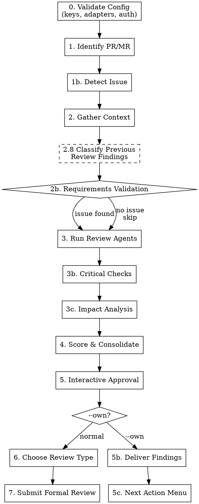

# flowyeah:review — PR/MR Review Pipeline

Reviews a pull request or merge request. Runs review agents, validates requirements, checks for critical patterns, and submits a formal review with inline comments. With `--own`, collects findings for self-audit without submitting. With `finalize`, tears down review state.

```
flowyeah:review [--own] [<number>]
flowyeah:review finalize [<number>]
```

## Invariant: Primary Checkout Is Untouched

The review pipeline must not mutate the working tree, the index, or HEAD of the checkout it was invoked from (the "primary checkout"). Forbidden in that checkout, at every phase: `git checkout`, `git restore`, `git switch`, `git reset`, `git apply`, `git am`, `git merge`, `git rebase`, `git pull`, `git stash`, `git clean`, `git cherry-pick`, `git revert`, `git rm`, `git mv`, `git bisect`, and any form like `git checkout <ref> -- <path>` that overwrites tracked files. `git fetch` (refs only, no working-tree side effects) is allowed.

Default to read-only commands when gathering context — they cover the great majority of needs:

| Need | Command |
|------|---------|
| PR diff, file list, commits | Review adapter API (`gh pr diff <N>`, GitLab diff endpoint) |
| File content at any SHA | `git show <sha>:<file>` |
| Per-line authorship at a SHA | `git blame <sha> -- <file>` |
| File history | `git log --oneline -10 <file>` |
| Recursive symbol search at a SHA | `git grep -n '<symbol>' <sha>` (requires that SHA's objects fetched locally) |

When deeper inspection is genuinely justified — running code at PR HEAD, applying a candidate patch to verify behavior, full-tree LSP/recursive-grep navigation against materialized files — create a dedicated review worktree at `.flowyeah/review-worktrees/{N}/`, perform the work there, and remove it before the session terminates. The worktree path is recorded in `Worktree:` inside `review-state-{N}.md` so `finalize` and crash recovery can clean it up unconditionally. The review worktree is **separate** from build worktrees at `.flowyeah/worktrees/` — never reuse a build worktree, and `finalize` for review must never touch build worktrees.

If a step appears to require a primary-checkout mutation, STOP and ask the user — the skill is wrong, not your judgment.

## Argument Parsing

If the first positional argument is `finalize`, the second positional (if present) is the PR number to finalize; otherwise, auto-detect from current branch. For non-finalize invocations, treat the positional as a PR number. The `--own` flag can appear in any position. `finalize` ignores `--own` — it operates on whatever active review session exists regardless of mode.

## Pipeline



## Configuration

Uses `flowyeah.yml` from the project root (see `config-schema.md` at the plugin root for full schema and defaults). **If missing, load `setup.md` from the plugin root and follow its interactive setup instructions before proceeding.**

The review skill uses: `code_review.agents`, `code_review.optional_agents`, `code_review.instructions`, `code_review.impact_analysis`, `git_host`, `language`, and adapter configs for issue detection.

**If `code_review.agents` is empty or missing: STOP and complain.**

## Platform Detection

The review adapter is determined from `git_host` in `flowyeah.yml`:

| `git_host` | Review adapter |
|------------|----------------|
| `gitlab` | `adapters/gitlab/review.md` |
| `github` | `adapters/github/review.md` |

Load the review adapter once at the start. **If the git host adapter has no `review.md`, STOP** — that adapter doesn't support code reviews. All platform-specific operations (fetch PR, post review, detect issue) go through the adapter.

**Thread operations live in the respond adapter.** Fetching other reviewers' open threads (step 2 item 9) and replying to existing threads (step 5's complement replies) are documented in `adapters/<host>/respond.md` — load it alongside the review adapter when those steps run. If the host has no `respond.md`, skip those steps rather than improvising API calls.

## Session (Lightweight)

Create `.flowyeah/review-state-{N}.md` for compaction resilience:

```markdown
# Current State

Type: review
Mode: <own or absent>
Status: Reviewing
PR/MR: <number>
Branch: <source_branch>
Platform: <adapter>
Findings: <count> total, <approved> approved
Phase: <current_phase>
Worktree: <relative path under .flowyeah/review-worktrees/{N}/ or "none">
```

`Mode` is absent for normal reviews. The hook does not interpret this field — it dumps the state file as raw text. The skill's crash recovery logic reads `Mode` to decide which path to follow on resume.

`Worktree` defaults to `none`. When the skill creates a review worktree (see "Invariant: Primary Checkout Is Untouched"), update this field to the path immediately and clear it back to `none` once the worktree is removed. The hook injects this field as-is on every prompt so context recovery can verify worktree state.

**Valid `Phase` values** (map to steps, used for crash recovery):

| Phase | Step | Recovery action |
|-------|------|-----------------|
| `Validating Config` | 0 | Re-run from start |
| `Identifying PR` | 1-1b | Re-run from start |
| `Gathering Context` | 2-2b | Re-run context gathering |
| `Running Agents` | 3-3c | Re-run agents (results lost) |
| `Scoring` | 4 | Re-run scoring (agent results lost) |
| `Interactive Approval` | 5 | Read `review-approved-{N}.md`, re-present unapproved findings |
| `Choosing Review Type` | 6 | Re-ask review type question |
| `Submitting Review` | 7 | Check if review was posted, retry or clean up |
| `Findings Delivered` | 5b-5c | Re-present the next action menu. If `review-approved-{N}.md` is missing, re-run from step 5 (Interactive Approval). |
| `Fixing` | after 5c | Do not resume the review pipeline. Findings are informational context. |
| `Delegated` | after 5c | Do not resume the review pipeline. Findings are informational context for the next session. |
| `Responded` | after 5c | Do not resume the review pipeline. A prior `respond --own` cycle closed this round. A fresh `review --own` invocation overwrites state silently; `review finalize` is still valid. |

After the user makes approval decisions (step 5), persist results to `.flowyeah/review-approved-{N}.md`:

```markdown
# Approved Findings

## Finding 1
- File: app/models/payment.rb:42
- Label: issue (blocking)
- Body: |
    **issue (blocking):** Race condition na criação de pagamento
    ...

## Finding 2
...
```

This file ensures that if compaction or a crash interrupts after approval, approved findings are recoverable.

Review sessions use `review-state-{N}.md` (not `state.md`) so they never interfere with build sessions in worktrees. Both can coexist — the injection hook handles them separately.

Update `review-state-{N}.md` after each phase transition. The hook injection ensures state survives compaction.

No `mission.md`, `progress.md`, or full `findings.md` — reviews are short-lived. Only `review-approved-{N}.md` is needed for the approval checkpoint.

### Crash Recovery

If a review session is interrupted (compaction, crash, user abort):

1. The hook injects `review-state-{N}.md` into the next prompt
2. Resume from the last recorded phase
3. If the phase was before "Interactive Approval" (step 5), re-run from that phase
4. If during or after approval, read `review-approved-{N}.md` to recover previously approved findings and skip re-presenting them
5. If the review was already submitted, clean up both state files
6. The user can also run `/review finalize` at any time to abandon the review and clean up state files

**Worktree reconciliation on resume.** If `Worktree:` in the recovered state is not `none`, run `git worktree list --porcelain` and check the recorded path:
- Path registered AND directory exists → reuse it
- Path registered but directory missing → run `git worktree prune`, then recreate or set `Worktree: none`
- Path unregistered but directory exists (orphaned) → `rm -rf` the directory and set `Worktree: none`
- Path is neither registered nor present → set `Worktree: none`

Never assume a recovered worktree is in the same state it was left in. Treat it as scratch.

#### Crash Recovery with `Mode: own`

When `Mode` is absent, the logic above applies unchanged (resume from recorded phase, proceed through steps 6-7).

When resuming a session with `Mode: own`:
- Phases before `Findings Delivered` — recover normally (re-run from that phase), but skip steps 6-7 after completion.
- `Findings Delivered` — re-present the next action menu (step 5c).
- `Fixing`, `Delegated`, or `Responded` — do nothing. The review pipeline is not active. State files serve as context only. For `Responded`, a fresh `/flowyeah:review --own {N}` invocation will start a new round and silently overwrite state.

## Steps

### 0. Validate Configuration

**Worktree guard:** if the current working directory is inside a flowyeah build worktree (`git rev-parse --show-toplevel` contains `.flowyeah/worktrees/`) or inside another review's dedicated worktree (`.flowyeah/review-worktrees/`), **STOP.** Reviews must be invoked from the primary checkout — review session files (`.flowyeah/review-state-{N}.md`) belong to the primary checkout, not to any worktree. Once invoked, the pipeline may itself create a worktree under `.flowyeah/review-worktrees/{N}/` for justified inspection (see "Invariant: Primary Checkout Is Untouched").

Before starting the review, validate the loaded `flowyeah.yml`:

1. **Load schema:** read `config-schema.md` from the plugin root.
2. **Check required keys:** `git_host` must point to an adapter with `review.md`. `code_review.agents` must be non-empty.
3. **Load review instructions:** if `code_review.instructions` is present in the config, validate the path is relative and the file exists (per validation rules in `config-schema.md`). Read the file contents once and carry them through the pipeline.
4. **Run validation rules:** execute relevant checks from the "Validation Rules" section of the schema.
5. **Auth verification:** verify credentials for the git host adapter and any source adapters that will be used for issue detection.
6. **Report all issues at once** — collect validation failures and present together.

If validation fails, STOP with actionable error messages.

### 1. Identify PR/MR

If `<number>` is provided, use it. Otherwise, detect from current branch via the review adapter.

Display PR/MR summary: title, author, branch, additions/deletions, changed files.

### 1b. Detect Associated Issue

Extract issue slug from the branch name. The patterns depend on the project's issue tracking:

**From configured adapters with `source.md`:**
- If `linear` is configured → try Linear patterns (e.g., `proj-eng-302`, `TEAM-123`)
- If `gitlab` is configured → try GitLab patterns (e.g., leading digits, `feat/42`)
- If `github` is configured → try GitHub patterns (e.g., `feat/42`)

Fetch issue details using the appropriate source adapter (load `adapters/<source>/connection.md` + `adapters/<source>/source.md`).

**If no issue found:** ask the user. If they say "none", skip requirements validation (step 2b).

### 2. Gather Context

Collect in parallel. **All commands here are read-only against the primary checkout** — no `checkout`, no `restore`, no `switch`. See "Invariant: Primary Checkout Is Untouched" if a step seems to require materializing files at a different ref.

1. **PR/MR diff** — via review adapter (`gh pr diff <N>` for GitHub, GitLab diff endpoint). Do NOT reconstruct via `git diff <base>...<head>` after a checkout.
2. **Files changed** — via review adapter. New-side file content, when needed beyond what the diff shows, comes from `git show <head_sha>:<file>` (read-only) — do not check out the PR branch into the primary checkout.
3. **Commit messages** — via review adapter
4. **CLAUDE.md files** — find all: global (`~/.claude/CLAUDE.md`), project root, `.claude/CLAUDE.md`, `.claude/standards/*.md`
5. **Git history** — for each changed file: `git log --oneline -10 <file>`
6. **Git blame** — for changed lines, run `git blame <base_sha> -- <file>` against the base SHA reported by the adapter. Do NOT check out the base branch.
7. **Previous PR/MR feedback** — search recent merged PRs/MRs that touched the same files, collect review comments (via the review adapter's "Search Recent Merged PR/MR Feedback" operation). Look for recurring themes — if a reviewer flagged the same pattern before, it's worth flagging again
8. **Previous review findings** — via review adapter's `Fetch Own Discussions`. Fetch all discussions/review comments authored by the authenticated user on this MR/PR. Parse Conventional Comments format to extract structured findings. If none found (first review), skip previous-review logic entirely
9. **Other reviewers' open threads** — via the respond adapter's thread fetch (see Platform Detection), collect all open (unresolved) review threads on the current PR/MR from other reviewers. For each thread, note: author, file:line, concern raised. Use these to avoid duplicating what others already flagged and to identify opportunities to complement their feedback (e.g., adding technical context, confirming a concern, or expanding on a suggestion)

#### 2.8 Classify Previous Review Findings

**Skip if no previous review discussions were found (first review).**

For each parsed previous finding, classify using the hybrid approach:

```
Resolved on platform?
├── yes → ADDRESSED
└── no
    └── Finding has file:line AND line falls within a changed hunk in the diff?
        ├── no → UNRESOLVED
        └── yes
            └── Semantic check: does the new code at that location address the concern?
                ├── uncertain/no → UNRESOLVED
                └── yes → ADDRESSED
```

**"Line changed"** — compare the finding's `file:line` against the MR/PR diff (already fetched in step 2.1). If the line falls within a changed hunk, it counts as changed.

**Semantic check** — read the previous finding's body and the new code at that location. Ask: "did the author's change target this specific concern?" When uncertain, classify as **unresolved** (safer to re-present than to silently drop).

Calibration examples:

| Finding | New code | Classification | Why |
|---------|----------|----------------|-----|
| Missing null check on `user.email` | Added `return unless user.email` guard | ADDRESSED | Directly targets the flagged concern |
| Race condition in payment creation | Added DB-level unique constraint + `RecordNotUnique` rescue | ADDRESSED | Solves the concurrency problem, even if differently than suggested |
| Missing error handling in API call | Line changed to rename a variable | UNRESOLVED | Change is unrelated to the concern |
| N+1 query in `orders#index` | Added `# TODO: fix N+1` comment | UNRESOLVED | Acknowledging isn't addressing |
| Performance concern on large datasets | Method rewritten with different logic in the area | UNCERTAIN → UNRESOLVED | Code changed but unclear if the concern was targeted |

**Findings without file:line** (review body findings) — can't be diff-checked. Classify as **unresolved** unless resolved on the platform.

**Output (platform discussions):** two lists — `addressed_findings[]` and `unresolved_findings[]`.

##### 2.8a Classify Persisted `--own` Rejections

**Skip if `--own` flag was not provided OR if `.flowyeah/own-rejections-{N}.md` does not exist.**

In `--own` mode, the platform-fetch path above produces nothing (rejections were never posted as platform discussions). Instead, read each `## Rejection ` block from `.flowyeah/own-rejections-{N}.md` (schema documented in `respond/SKILL.md`'s "Cross-Round Persistence: `own-rejections-{N}.md`" section) and apply the same diff-overlap rule used for platform findings:

```
File: line still present in changed hunks?
├── line not in any hunk → STILL_REJECTED (carry forward as agent context)
│   The line is either untouched this round or was reverted; the diff alone cannot distinguish
│   those cases, so the conservative default keeps the rejection in effect.
│   Cleared by /flowyeah:review finalize {N}.
└── line in a changed hunk
    └── Semantic check: does the new code at that location address the concern?
        ├── uncertain/no → STILL_REJECTED
        └── yes (the author's recent edits target the rejected concern) → STALE_REJECTION (drop silently — semantic check confirmed the concern was addressed; surfacing it again would be noise)
```

For entries with `File: (general)` (no precise line), the diff-overlap rule cannot apply. Treat them as `STILL_REJECTED` unconditionally — there is no signal that says they have been addressed. The author can clear all persisted rejections (general and specific alike) by running `/flowyeah:review finalize {N}`, which removes the entire ledger.

**Output (persisted rejections):** one list — `previously_rejected_findings[]`. Each entry preserves `File:`, `Label:`, `Subject:`, and `Reasoning:`.

This list is **separate** from `unresolved_findings[]`. It does not get carried forward as a user-visible finding (see step 4, consolidation rule 7) — it is used only as agent context (see step 3, Run Review Agents).

### 2b. Requirements Validation

**Skip if no issue was found in step 1b.**

Analyze in 3 dimensions:

**Completeness:** Does the implementation cover everything the issue asks for? For each requirement/acceptance criterion in the issue, check if the diff contains corresponding implementation. Generate a finding for unimplemented requirements.

**Scope:** Is there code unrelated to what the issue asks for? Compare changed files/logic against the issue's scope. Use good judgment — refactoring needed for the feature IS pertinent.

**Coherence:** Does the implementation approach make sense to solve the described problem? Flag when the implementation seems to solve a different problem than what the issue describes.

### 3. Run Review Agents

Launch agents from `code_review.agents` in parallel using the Task tool:

- Pass each agent the PR diff and changed files
- Each agent returns findings as: file, line, issue, severity, confidence (0-100)

If `code_review.instructions` is configured, include the file contents as additional context passed to each agent alongside the PR diff and changed files. Instructions may reference external resources (a docs URL, a linked issue); agents resolve those using available tools (WebFetch, source adapters) to verify compliance rather than treating the reference as passive text.

If `unresolved_findings[]` from step 2.8 is non-empty, pass them to each agent as additional context: "The following findings were raised in a previous review and remain unresolved. Do not re-flag these — they will be carried forward separately." This prevents agents from producing duplicates.

If `previously_rejected_findings[]` from step 2.8a is non-empty (only possible in `--own` mode), pass them to each agent as a **second** additional context block — kept separate from `unresolved_findings[]` because the directives differ (the first block is an unconditional "do not re-flag"; the second is conditional on whether the agent has new information): "The author has previously reviewed and rejected the following concerns with explicit reasoning. Do not re-flag any of them unless you have substantively new information that the author's reasoning did not account for. If you genuinely have new information, raise it as a new finding — do not duplicate the rejected one." Include each entry's `File:`, `Subject:`, and full `Reasoning:` block. The "substantively new information" clause matters: a rejection is not permanent infallibility, but the bar is high. The operational test: the diff itself must have changed the factual basis of the rejection — e.g., a migration the reasoning relied on was reverted, a config the reasoning assumed was added, an upstream caller the reasoning ignored is now in scope. A different way of framing the same concern is NOT new information; only a change in the underlying facts is. When the test is met, the agent flags it as a fresh finding (not as a re-raised rejection).

**Conditional agents** from `code_review.optional_agents` — launch based on what changed (e.g., security analyst if auth code was touched). Use judgment.

**Note:** This is the same agent configuration used by `flowyeah:build` in step 7b (CI + Code Review Loop). Both skills share the `code_review.agents` and `code_review.optional_agents` lists from `flowyeah.yml`. The difference: build runs agents as a quality gate before merge; review produces a formal review artifact with inline comments.

### 3b. Critical Checks

Run directly (not delegated to agents):

**Database Concurrency:** For any migration adding an index, verify if it should be unique. Application-level validations are NOT sufficient for concurrency — DB constraints are required. If a unique index exists, check for `RecordNotUnique` rescue.

**CLAUDE.md Compliance:** Check global and project CLAUDE.md rules against the diff (e.g., ABOUTME comments, naming conventions, error handling).

**Naming Consistency:** Flag semantic inconsistencies — names that contradict each other, method names that don't match behavior.

**Project Review Guidelines:** If `code_review.instructions` is configured, evaluate the diff against each guideline in the instructions file. Act on guidelines that reference external resources — resolve them via available tools (WebFetch, source adapters); if a resource cannot be fetched, record the guideline as unverified rather than implying compliance. Default scoring: severity `issue`, confidence 75. Adjust based on how clearly the diff violates a guideline.

**Scoring for critical checks:** DB concurrency findings default to severity `issue (blocking)` with confidence 90. CLAUDE.md compliance defaults to severity `issue` with confidence 75. Naming consistency defaults to `suggestion (non-blocking)` with confidence 50. Adjust based on evidence. (API backward compatibility moved to step `3c Impact Analysis` as a contract-break special case.)

### 3c. Impact Analysis

Run directly (like `3b`). Runs on **every** review — not gated on an issue being found.

**Executor.** If `code_review.impact_analysis` is configured, delegate this entire step to the named agent, passing it the PR diff, the identified changed public surface (below), and the trigger-line anchoring contract. That agent may create the review worktree at `.flowyeah/review-worktrees/{N}/` for LSP/codegraph-grade tracing (see "Invariant: Primary Checkout Is Untouched"). Because the delegated agent runs in its own context and cannot be relied on to record or tear down that worktree, set `Worktree:` in `review-state-{N}.md` to `.flowyeah/review-worktrees/{N}/` **before** invoking the agent — so `finalize` and crash recovery can reclaim it even if the agent exits without cleaning up. After the agent returns, if no worktree remains, clear `Worktree:` back to `none` (the recovery reconciliation rules handle a recorded-but-absent path). Otherwise, run the built-in logic below. The step **always runs — it cannot be disabled**; only its executor is swappable.

From the diff, identify the **changed public surface**: modified or removed method signatures, return shapes, serializers, event/webhook payloads, job arguments, and changed defaults. For each element, trace outward across three dimensions using **read-only commands only** (no checkout, no worktree in the built-in path):

**Caller ripple:** For a changed signature, return shape, or default, run `git grep -n '<symbol>' <head_sha>` against the PR HEAD SHA reported by the adapter to find callers. Flag callers whose behavior shifts under the change. Default severity `issue`, confidence 75.

**Contract/interface breaks:** For a changed API response, event/webhook payload, serializer, job argument, or shared schema, locate consumers (serializers, API responses, webhooks, jobs, other services) and flag those that break. Default severity `issue (blocking)`, confidence 85.
- **Special case — migration removing a column:** exposed columns CANNOT be removed; they must be deprecated. Search serializers, API responses, and webhooks for the removed column. Default severity `issue (blocking)`, confidence 90 (concrete, enumerable consumer set).

**Feature interaction / coupling:** Flag changes to shared services or state that adjacent features rely on, where the change creates unintended cross-feature effects. Default severity `suggestion (non-blocking)`, confidence 60.

**Out of scope:** runtime/scale & operational concerns — N+1s introduced app-wide, deploy/migration ordering, rollback safety, feature-flag interactions. These are covered by `code_review.optional_agents` (e.g. a performance analyst), not by this step.

**Anchoring.** Every impact finding anchors to the **trigger line** — the changed line in the diff that causes the ripple (the modified signature, the removed column, the changed default). The comment body names the affected untouched code as a `file:line` reference in prose and describes the effect. Never place an impact finding in the review body; never anchor to an untouched line. This keeps step 7's "every finding is an inline comment" and step 4's "Touched it, own it" invariants intact.

Adjust all default scores based on evidence, the same as `3b`.

### 4. Score & Consolidate

**Severity** (determined by the Conventional Comments label):

| Severity | Label | Description |
|----------|-------|-------------|
| Blocker | `issue (blocking)` | Must fix before merge. Will cause production bugs. |
| Important | `issue` | Should be fixed. May cause problems. |
| Suggestion | `suggestion (non-blocking)` | Nice to have. Improves code quality. |
| Nitpick | `nitpick (non-blocking)` | Minor. Only mention if few other issues. |
| Informational | `question`, `thought`, `note` | Not a fix request — seeks clarification or shares context. |

**Confidence scoring (0-100)** — how certain you are that the finding is real:

| Score | Meaning |
|-------|---------|
| 0 | False positive |
| 25 | Might be real, couldn't verify. Stylistic issue not in CLAUDE.md |
| 50 | Verified real issue, minor or nitpick |
| 75 | Highly confident. Verified, impacts functionality, or explicitly in CLAUDE.md |
| 100 | Absolutely certain. Confirmed, will happen frequently |

**Consolidate findings:**
1. Remove duplicates (same file+line+issue from multiple sources)
2. Sort by severity (blocker first), then by confidence within each severity level
3. Group by category
4. Deduplicate against previous findings — if an agent finding matches an unresolved previous finding (same file, overlapping lines, same concern), remove the agent finding in favor of the previous one. The previous finding carries more weight as a "previously raised" item
5. Deduplicate against other reviewers' open threads — if a finding raises the same concern another reviewer already flagged (same file, overlapping lines, same issue), drop the finding. Instead, if you have useful context to add, note it for a reply to their thread (see step 5 presentation). Don't repeat what someone else already said
6. Inject `unresolved_findings[]` into the consolidated list. Each gets tagged `(previously raised, still unresolved)`. They keep their original severity — no escalation, no demotion
7. Do **not** inject `previously_rejected_findings[]` into the consolidated list. The user already rejected these — re-presenting them would defeat the persistence mechanism. They served their purpose as agent context in step 3. The only thing that surfaces them again is if an agent legitimately raises the same concern with new information, in which case it lands as a regular new finding (not as a rejected-and-re-raised one — the agent has attested to new facts, so the prior rejection no longer applies; annotating the finding as "previously rejected" would prejudice the user against the agent's new framing).

**False positive rubric — do NOT flag:**
- Something that looks like a bug but isn't
- Pedantic nitpicks a senior engineer wouldn't mention
- Issues linters/typecheckers/CI will catch
- General quality issues unless explicitly in CLAUDE.md
- Issues silenced with lint-ignore comments
- Language-specific linter defaults in generated/migration files (e.g., Ruby's `frozen_string_literal` in migrations)

**"Touched it, own it":** If the PR touches a file (even for refactoring), the author is responsible for issues in that code. Only truly untouched lines are excluded.

**Include at least one `praise`:** Surface at least one sincere `praise` finding for the user to consider — but never false praise. Look for something genuinely good. The praise is a finding like any other: the user's batch decision in step 5 governs whether it is submitted. An excluded praise is never resurfaced — not as an inline comment, not in the review body.

### 5. Interactive Approval

Present **all findings at once** as a numbered list. Every finding MUST be rendered using the **Finding Card** format defined below. This is the canonical presentation for every finding the user sees — here and in step 5b — and it is shared with `flowyeah:respond`'s triage screen (keep the two in sync). The card is not decoration; it is the contract. Never substitute a prose paragraph, a compressed bullet list, or a table for it.

**Finding Card format:**

```
═══════════════════════════════════════════════════════════
Finding 1
═══════════════════════════════════════════════════════════
Label:      [issue/suggestion/nitpick/...] ([blocking/non-blocking])
Confidence: [score]/100
File:       [path:line]
Source:     [agent/analysis that found it]

┌─────────────────────────────────────────────────────────
│ **[label] ([decoration]):** [subject]
│
│ [discussion - context, justification, suggested code]
└─────────────────────────────────────────────────────────
```

**Variants:**

- **Previously raised** — append `  ⟳ PREVIOUSLY RAISED` to the `Finding N` title line, set `Source: previous review`, and open the discussion with a `⟳ Previously flagged, still unresolved.` line:

```
═══════════════════════════════════════════════════════════
Finding 2  ⟳ PREVIOUSLY RAISED
═══════════════════════════════════════════════════════════
Label:      [original label] ([original decoration])
Confidence: [original score]/100
File:       [path:line]
Source:     previous review

┌─────────────────────────────────────────────────────────
│ **[label] ([decoration]):** [subject]
│
│ ⟳ Previously flagged, still unresolved.
│ [original discussion body]
└─────────────────────────────────────────────────────────
```

- **Praise** — same card, with `Confidence: —` and no `(decoration)` after the label.

Render every finding as its own card, in order, one after another.

#### Anti-pattern (do not do this)

```
✗ WRONG — prose summary instead of cards

Finding 1 — issue (non-blocking) · confidence 80
app/models/.../access_token.rb:11

The new .timeout(...) makes the token request fail fast, but the resulting
error is not normalized anywhere in the chain...

---
Finding 2 — suggestion (non-blocking) · confidence 75
...
```

This shape is forbidden because it:
- Drops the `═══` header and `┌─│└` comment box, collapsing the scannable `Label`/`Confidence`/`File`/`Source` fields into a run-on header line.
- Buries the conventional-comment body in a prose paragraph, so the user can't see at a glance what would actually be posted as the inline comment.
- Produces the "wall of text" the card format exists to prevent.

Render the **Finding Card** for every finding, every time — even when there is only one finding, even under `--own`, even when you are tempted to "just summarize."

**Other reviewers' open threads:** After the findings list, if any open threads from other reviewers were found (step 2.9) and you have complementary context to add (technical justification, confirmation with evidence, expanded scope), present them separately:

```
───────────────────────────────────────────────────────
Other reviewers' open threads — complement opportunities
───────────────────────────────────────────────────────

Thread A (@reviewer · file:line):
  Their concern: [summary]
  Your complement: [what you'd add — e.g., confirming with evidence, expanding scope]

Thread B (@reviewer · file:line):
  Their concern: [summary]
  Your complement: [what you'd add]
```

These are **not** findings — they are reply suggestions. The user can approve, edit, or skip each. Approved complements are posted as replies to the existing threads (via the respond adapter's Reply to Thread operation — see Platform Detection) alongside the formal review submission in step 7.

After presenting the full list, ask the user for a **batch decision**:

1. **Approve all** — include every finding in the review
2. **Select specific** — user provides finding numbers to include (e.g., `1,3,5`). Everything else is skipped
3. **Skip below severity** — approve all findings, skip those below a severity threshold (e.g., skip nitpicks)
4. **Discard all** — submit review with no inline findings

If the user selects specific findings and wants to **edit** any before submission, ask which numbers to edit and expand them one at a time for modification.

Persist approved findings to `review-approved-{N}.md` after the batch decision is made.

### `--own` Mode: Steps 5b-5c

**If `--own` flag was NOT provided, skip to step 6.**

#### 5b. Deliver Findings

Persist approved findings to `review-approved-{N}.md` (already done in step 5). Present them using the **Finding Card** format from step 5 — one card per finding, exactly as in normal mode. Do not collapse them into a concise list or summary table; the card is the standard here too.

Update `review-state-{N}.md`: set `Phase: Findings Delivered`.

#### 5c. Next Action Menu

Offer three options:

1. **Fix now** — the skill pipeline terminates. Phase is set to `Fixing`. State files remain as informational context (the hook injects them each prompt, but they do not trigger the review pipeline). When done, the user runs `/review finalize` to clean up.
2. **Delegate** — the skill pipeline terminates. Phase is set to `Delegated`. Open a fresh session in the main checkout and run `/flowyeah:respond --own {N}` to critique, discuss, and fix. The respond pipeline will read `.flowyeah/review-approved-{N}.md` and the new `Phase: Responded` is written when the round completes, enabling a fresh `review --own` for the next round.
3. **Finalize** — clean up state files immediately (equivalent to `/review finalize`).

#### Conflict: Re-invoking `/review` with an active session

Before starting a new review, check both directions:

1. **By PR number:** if `review-state-{N}.md` exists for the target PR, that session is the conflict — regardless of which branch you are currently on. (Matching only the current branch would silently overwrite an active session when `/review N` is run from elsewhere.)
2. **By branch:** glob `review-state-*.md` and match `Branch:` against the current branch, for the auto-detect case.
3. **Respond coexistence:** if `respond-state-{N}.md` exists for the target PR, STOP: "A respond session for PR #N is mid-pipeline. Complete it (or remove its state files / run `/flowyeah:status clean`) before reviewing." Review and respond must not run concurrently on the same PR.

For a review-state match:

- `Phase: Responded` → proceed silently — the prior round is closed. Overwrite the existing state files as if no session existed. Do not prompt.
- `Phase: Fixing` or `Phase: Delegated` → present: "An --own review for PR #N is still active. Finalize it first, or continue fixing?"
- Any other phase → present: "A review for PR #N is already active (phase: X). Finalize it first?"

If the user chooses to finalize, run the finalize logic and stop. The user must re-invoke `/review` for a new session.

### 6. Choose Review Type

After all findings are processed, present the recommendation and ask the user:

**Recommendation logic** (based on approved findings):
- If any approved finding has label `issue (blocking)` → recommend **Request Changes**
- Else if any approved finding has label `issue` → recommend **Comment**
- Else (only suggestions, nitpicks, praise, or no findings) → recommend **Approve**

Present the recommendation alongside the options. Mark the recommended option:

1. **Request Changes** — formal review requesting changes
2. **Comment** — formal review with comments only
3. **Approve** — approve with observations

### 7. Submit Formal Review

**MANDATORY:** Always submit as a formal platform review with inline comments. Never post a generic timeline comment.

Load the review adapter and follow its instructions to:

1. Build inline comments array — **every approved finding** becomes an inline comment. If a finding lacks a precise line, find the best anchor (see Error Handling). No findings go in the review body — the body is a summary, not a fallback destination.
2. Build review body (consolidated summary only — requirements validation, previous review follow-up, and overview. No findings.)
3. Submit the formal review with the event type chosen in step 6

**All inline comments use [Conventional Comments](https://conventionalcomments.org/) format:**

```
**<label> [decorations]:** <subject>

[discussion]
```

**Labels:** `praise`, `issue`, `suggestion`, `todo`, `question`, `thought`, `nitpick`, `chore`, `note`

**Decorations:** `(blocking)`, `(non-blocking)`, `(if-minor)`

Ask for final confirmation before posting.

**APPROVE review comment placement:** When the event is `APPROVE`, split findings by type:
- **Praise findings** → include in the review body only (the approval itself is the positive signal; inline praise is noise)
- **Non-praise findings** (suggestions, issues, nitpicks, questions, etc.) → submit as inline comments to create open threads, ensuring they get read

This differs from `COMMENT` and `REQUEST CHANGES`, where all findings (including praise) are posted as inline comments. The review adapter's event documentation has the details.

After posting (or if the user discards), remove `.flowyeah/review-state-{N}.md` and `.flowyeah/review-approved-{N}.md` to end the session. If `Worktree:` is set in the state file, also run `git worktree remove --force <path>` and `rm -rf` the directory if anything remains. **Do not** remove `.flowyeah/own-rejections-{N}.md` here — that file persists until the user explicitly runs `/flowyeah:review finalize {N}` (a normal-mode submitted review is unrelated to the `--own` rejection ledger).

### `finalize` Subcommand

A separate entry point that tears down review state. Not a pipeline step.

```
flowyeah:review finalize [<number>]
```

**With explicit number:** target `review-state-{N}.md` directly. If absent, report "No active review for PR #{N}." and stop.

**Without number (auto-detect):**
1. Get current branch
2. Glob `review-state-*.md`, extract `Branch:` from each
3. Zero matches → list all active reviews (PR number + branch from each state file) and ask which to finalize
4. One match → use it
5. Multiple matches → list and ask

After resolving the target:
1. Read the state file. Display: PR number, findings count, mode, worktree path (if any).
2. If `Worktree:` is set and not `none`: run `git worktree remove --force <path>`, then `rm -rf <path>` if the directory still exists. Report any failure but proceed with the remaining cleanup — the state file deletion must not be blocked by a stuck worktree.
3. Delete `review-state-{N}.md`, `review-approved-{N}.md` (if present), and `own-rejections-{N}.md` (if present).
4. Delete `respond-state-{N}.md` and `respond-decisions-{N}.md` if present — respond has no finalize of its own, so a respond round that crashed mid-pipeline leaves them behind, and they keep `tree-guard` blocking the branch after "finalized" was reported.
5. Never touch anything under `.flowyeah/worktrees/` — those belong to build sessions, not to review.
6. Report: "Review session finalized."

No confirmation prompt — the explicit `finalize` command is sufficient intent.

No platform interaction. No re-running agents. No verification of whether findings were addressed.

`finalize` works on any review session — both `--own` and normal. For normal reviews interrupted mid-pipeline (e.g., crashed after step 3), `finalize` serves as an escape hatch to discard the session without submitting.

`finalize` does not display the timing summary.

### Review Body Template

```markdown
## Code Review

### Requirements Validation
<!-- Only if issue was found -->
**Issue:** [slug](link) — "Issue title"

#### Requirement Coverage
- ✅ Requirement A — implemented in `app/services/...`
- ❌ Requirement B — not found in diff
- ⚠️ Requirement C — partial implementation

### Previous Review Follow-up
<!-- Only if previous review findings were found -->

#### Resolved
- ✅ `file:line` — [subject] ([resolution reason: resolved on platform / code changed, addresses concern])

#### Still Unresolved
- ⟳ `file:line` — [subject] (see inline comment)

### Code Review Summary
[consolidated summary of findings]
```

## Timing

After the review is submitted (or discarded), display a summary:

```
Review complete — N findings (M approved, K skipped)
  Blockers: X | Important: X | Suggestions: X
  Automated phases: ~Xs | Interactive approval: ~Xs
```

No per-phase instrumentation needed. Just track two timestamps: start of step 0 and start of step 5 (interactive approval). The difference gives automated time; wall clock from step 5 to end gives interactive time.

## Comment Language

Review comments are written in the language configured in `language`. Default: `en`.

## Error Handling

| Error | Action |
|-------|--------|
| PR/MR not found | Ask user for number/URL |
| Agent fails | Report which failed, continue with others |
| Remote communication failure (401, 403, 429, 5xx, timeout) | Retry up to 2 times with a short pause. If still failing, **STOP and report the error to the user.** Do not attempt alternative approaches or workarounds. |
| Inline comment position not in diff | Find the best anchor: the most relevant changed line in the same file, or the file's first changed line. If the file has no changed lines at all (finding from a cross-cutting concern), anchor on the most relevant file's first changed hunk. Every finding MUST become an inline comment — never move findings to the review body. |

## Never

**Note:** The submission rules below apply to the normal review path (steps 6-7). `--own` mode does not submit — these rules do not apply to self-audit reviews.

- Post without explicit user approval
- Include findings the user skipped
- Use `gh pr review --comment --body` (that's not an inline review)
- Post a generic timeline comment instead of a formal review
- Skip the review type question
- Submit a review without inline comments (when there are approved findings with file:line)
- Put findings in the review body instead of as inline comments. Every finding is a stop-point for the reviewed developer — it must create an open thread they need to resolve. The review body is a summary layer only.
- Mutate the working tree, index, or HEAD of the primary checkout at any phase, including context gathering. Use `.flowyeah/review-worktrees/{N}/` for any necessary mutation (see "Invariant: Primary Checkout Is Untouched"). The pre-tool-use hook `tree-guard.sh` enforces this — if it blocks a command, do not retry, escalate, or work around it; either move the work into the review worktree or stop and ask the user.
