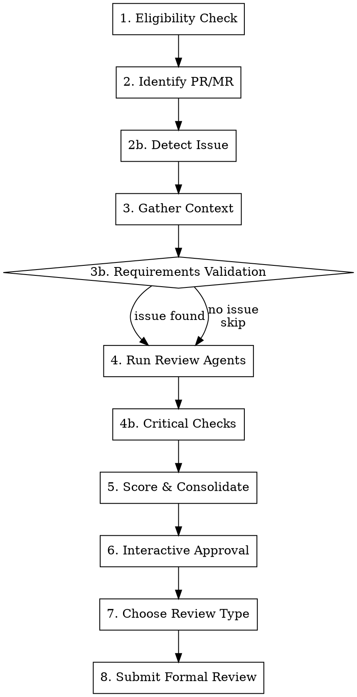

# /review — PR/MR Review Pipeline

Reviews a pull request or merge request. Runs review agents, validates requirements, checks for critical patterns, and submits a formal review with inline comments.

```
/review [<number>]
```

## Pipeline



## Configuration

Uses `flowyeah.yml` from the project root:

```yaml
# Review agents (same as /flowyeah uses)
code_review:
  agents:
    - pr-review-toolkit:code-reviewer
    - pr-review-toolkit:silent-failure-hunter
  optional_agents:
    - pr-review-toolkit:code-quality-analyst

# Sink determines the review platform
sink:
  adapter: gitlab    # or github

# Language for review comments
pull_requests:
  language: pt-br    # review content language
```

**If `code_review.agents` is empty or missing: STOP and complain.**

## Platform Detection

The review adapter is determined from `sink.adapter` in `flowyeah.yml`:

| `sink.adapter` | Review adapter |
|-----------------|----------------|
| `gitlab` | `adapters/gitlab/review.md` |
| `github` | `adapters/github/review.md` |

Load the review adapter once at the start. All platform-specific operations (fetch PR, post review, detect issue) go through the adapter.

## Session (Lightweight)

Create `.flowyeah/state.md` for compaction resilience:

```markdown
# Current State

Status: Reviewing
PR/MR: <number>
Branch: <source_branch>
Platform: <adapter>
Findings: <count> total, <approved> approved
Phase: <current_phase>
```

Update after each phase transition. The hook injection ensures state survives compaction.

No `mission.md`, `progress.md`, or `findings.md` — reviews are short-lived and don't need the full session.

## Steps

### 1. Eligibility Check

Use the review adapter to fetch PR/MR details.

**Skip review if:**
- PR/MR is closed or merged
- PR/MR is a draft
- PR/MR is trivial (automated dependency bump, typo fix with <5 lines changed)
- You already reviewed this PR (check for existing comment with "Generated with Claude Code")

If ineligible, explain why and ask if the user wants to proceed anyway.

### 2. Identify PR/MR

If `<number>` is provided, use it. Otherwise, detect from current branch via the review adapter.

Display PR/MR summary: title, author, branch, additions/deletions, changed files.

### 2b. Detect Associated Issue

Extract issue slug from the branch name. The patterns depend on the project's issue tracking:

**From `flowyeah.yml` sources:**
- If `sources.linear` is configured → try Linear patterns (e.g., `proj-eng-302`, `TEAM-123`)
- If `sources.gitlab` is configured → try GitLab patterns (e.g., leading digits, `feat/42`)
- If `sources.github` is configured → try GitHub patterns (e.g., `feat/42`)

Fetch issue details using the appropriate source adapter.

**If no issue found:** ask the user. If they say "none", skip requirements validation (step 3b).

### 3. Gather Context

Collect in parallel:

1. **PR/MR diff** — via review adapter
2. **Files changed** — via review adapter
3. **Commit messages** — via review adapter
4. **CLAUDE.md files** — find all: global (`~/.claude/CLAUDE.md`), project root, `.claude/CLAUDE.md`, `.claude/standards/*.md`
5. **Git history** — for each changed file: `git log --oneline -10 <file>`

### 3b. Requirements Validation

**Skip if no issue was found in step 2b.**

Analyze in 3 dimensions:

**Completude (Completeness):** Does the implementation cover everything the issue asks for? For each requirement/acceptance criterion in the issue, check if the diff contains corresponding implementation. Generate a finding for unimplemented requirements.

**Pertinência (Scope Creep):** Is there code unrelated to what the issue asks for? Compare changed files/logic against the issue's scope. Use good judgment — refactoring needed for the feature IS pertinent.

**Coerência (Coherence):** Does the implementation approach make sense to solve the described problem? Flag when the implementation seems to solve a different problem than what the issue describes.

### 4. Run Review Agents

Launch agents from `code_review.agents` in parallel using the Task tool:

- Pass each agent the PR diff and changed files
- Each agent returns findings as: file, line, issue, severity, confidence (0-100)

**Conditional agents** from `code_review.optional_agents` — launch based on what changed (e.g., security analyst if auth code was touched). Use judgment.

### 4b. Critical Checks

Run directly (not delegated to agents):

**Database Concurrency:** For any migration adding an index, verify if it should be unique. Application-level validations are NOT sufficient for concurrency — DB constraints are required. If a unique index exists, check for `RecordNotUnique` rescue.

**API Backward Compatibility:** For any migration removing columns, search serializers, API responses, and webhooks. Exposed columns CANNOT be removed — must be deprecated.

**CLAUDE.md Compliance:** Check global and project CLAUDE.md rules against the diff (e.g., ABOUTME comments, naming conventions, error handling).

**Naming Consistency:** Flag semantic inconsistencies — names that contradict each other, method names that don't match behavior.

### 5. Score & Consolidate

**Confidence scoring (0-100):**

| Score | Meaning |
|-------|---------|
| 0 | False positive |
| 25 | Might be real, couldn't verify. Stylistic issue not in CLAUDE.md |
| 50 | Verified real issue, minor or nitpick |
| 75 | Highly confident. Verified, impacts functionality, or explicitly in CLAUDE.md |
| 100 | Absolutely certain. Confirmed, will happen frequently |

**Consolidate findings:**
1. Remove duplicates (same file+line+issue from multiple sources)
2. Sort by severity (blocker first), then by confidence
3. Group by category

**False positive rubric — do NOT flag:**
- Something that looks like a bug but isn't
- Pedantic nitpicks a senior engineer wouldn't mention
- Issues linters/typecheckers/CI will catch
- General quality issues unless explicitly in CLAUDE.md
- Issues silenced with lint-ignore comments
- Missing `frozen_string_literal` in migration files

**"Touched it, own it":** If the PR touches a file (even for refactoring), the author is responsible for issues in that code. Only truly untouched lines are excluded.

### 6. Interactive Approval

For each finding, present to the user:

```
═══════════════════════════════════════════════════════════
Finding [N of TOTAL]
═══════════════════════════════════════════════════════════

Label:      [issue/suggestion/nitpick/...] ([blocking/non-blocking])
Confidence: [score]/100
File:       [path:line]
Source:     [agent/analysis that found it]

Comment (Conventional Comments format):
┌─────────────────────────────────────────────────────────
│ **[label] ([decoration]):** [subject]
│
│ [discussion - context, justification, suggested code]
└─────────────────────────────────────────────────────────
```

**Options:**
1. **Approve** — include in final review
2. **Approve with edit** — modify text before including
3. **Skip** — don't include this finding
4. **Skip all below [severity]** — skip remaining findings below threshold
5. **Stop** — finalize with approved findings so far

### 7. Choose Review Type

After all findings are processed, ask the user:

1. **Request Changes** — formal review requesting changes
2. **Comment** — formal review with comments only
3. **Approve** — approve with observations

### 8. Submit Formal Review

**MANDATORY:** Always submit as a formal platform review with inline comments. Never post a generic timeline comment.

Load the review adapter and follow its instructions to:

1. Build inline comments array (each approved finding with file:line)
2. Build review body (consolidated summary + findings without specific lines)
3. Submit the formal review with the event type chosen in step 7

**All inline comments use [Conventional Comments](https://conventionalcomments.org/) format:**

```
**<label> [decorations]:** <subject>

[discussion]
```

**Labels:** `praise`, `issue`, `suggestion`, `todo`, `question`, `thought`, `nitpick`, `chore`, `note`

**Decorations:** `(blocking)`, `(non-blocking)`, `(if-minor)`

**Include at least one `praise` comment per review** — but never false praise. Look for something to sincerely praise.

Ask for final confirmation before posting.

### Review Body Template

```markdown
## Code Review

### Requirements Validation
<!-- Only if issue was found -->
**Issue:** [slug](link) — "Issue title"

#### Requirement Coverage
- ✅ Requirement A — implemented in `app/services/...`
- ❌ Requirement B — not found in diff
- ⚠️ Requirement C — partial implementation

### Code Review Summary
[consolidated summary of findings]

---
🤖 Generated with [Claude Code](https://claude.ai/code)
```

## Comment Language

Review comments are written in the language configured in `pull_requests.language`. Default: `en`.

## Error Handling

| Error | Action |
|-------|--------|
| PR/MR not found | Ask user for number/URL |
| Agent fails | Report which failed, continue with others |
| Auth failed | Guide to authentication setup |
| Rate limited | Report and suggest waiting |
| Inline comment position not in diff | Move finding to review body |

## Never

- Post without explicit user approval
- Include findings the user skipped
- Use `gh pr review --comment --body` (that's not an inline review)
- Post a generic timeline comment instead of a formal review
- Skip the review type question
- Submit a review without inline comments (when there are approved findings with file:line)
