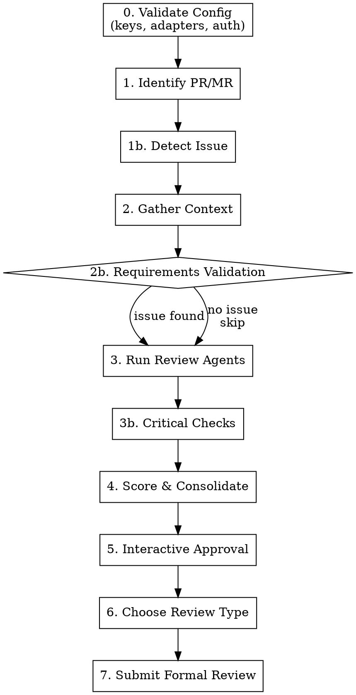

# flowyeah:review — PR/MR Review Pipeline

Reviews a pull request or merge request. Runs review agents, validates requirements, checks for critical patterns, and submits a formal review with inline comments.

```
flowyeah:review [<number>]
```

## Pipeline



## Configuration

Uses `flowyeah.yml` from the project root. **If missing, load `setup.md` from the plugin root and follow its interactive setup instructions before proceeding.**

```yaml
# Review agents (same as flowyeah:build uses)
code_review:
  agents:
    - pr-review-toolkit:code-reviewer
    - pr-review-toolkit:silent-failure-hunter
  optional_agents:
    - pr-review-toolkit:comment-analyzer
    - pr-review-toolkit:type-design-analyzer

# Sources determine which adapters are available for issue detection
sources:
  - gitlab
  - linear

# Hosting determines the review platform
hosting: gitlab       # gitlab | github — points to adapters.<hosting>

# Language for all text output (commits, PRs, review comments)
language: pt-br
```

**If `code_review.agents` is empty or missing: STOP and complain.**

## Platform Detection

The review adapter is determined from `hosting` in `flowyeah.yml`:

| `hosting` | Review adapter |
|------------|----------------|
| `gitlab` | `adapters/gitlab/review.md` |
| `github` | `adapters/github/review.md` |

Load the review adapter once at the start. **If the hosting adapter has no `review.md`, STOP** — that adapter doesn't support code reviews. All platform-specific operations (fetch PR, post review, detect issue) go through the adapter.

## Session (Lightweight)

Create `.flowyeah/review-state.md` for compaction resilience:

```markdown
# Current State

Type: review
Status: Reviewing
PR/MR: <number>
Branch: <source_branch>
Platform: <adapter>
Findings: <count> total, <approved> approved
Phase: <current_phase>
```

**Valid `Phase` values** (map to steps, used for crash recovery):

| Phase | Step | Recovery action |
|-------|------|-----------------|
| `Validating Config` | 0 | Re-run from start |
| `Identifying PR` | 1-1b | Re-run from start |
| `Gathering Context` | 2-2b | Re-run context gathering |
| `Running Agents` | 3-3b | Re-run agents (results lost) |
| `Scoring` | 4 | Re-run scoring (agent results lost) |
| `Interactive Approval` | 5 | Read `review-approved.md`, continue from next unapproved finding |
| `Choosing Review Type` | 6 | Re-ask review type question |
| `Submitting Review` | 7 | Check if review was posted, retry or clean up |

During interactive approval (step 5), persist each approval decision to `.flowyeah/review-approved.md`:

```markdown
# Approved Findings

## Finding 1
- File: app/models/payment.rb:42
- Label: issue (blocking)
- Body: |
    **issue (blocking):** Race condition na criação de pagamento
    ...

## Finding 2
...
```

This file ensures that if compaction or a crash interrupts the approval flow, previously approved findings are recoverable.

Review sessions use `review-state.md` (not `state.md`) so they never interfere with build sessions in worktrees. Both can coexist — the injection hook handles them separately.

Update `review-state.md` after each phase transition. The hook injection ensures state survives compaction.

No `mission.md`, `progress.md`, or full `findings.md` — reviews are short-lived. Only `review-approved.md` is needed for the approval checkpoint.

### Crash Recovery

If a review session is interrupted (compaction, crash, user abort):

1. The hook injects `review-state.md` into the next prompt
2. Resume from the last recorded phase
3. If the phase was before "Interactive Approval" (step 5), re-run from that phase
4. If during or after approval, read `review-approved.md` to recover previously approved findings and continue from the next unapproved finding
5. If the review was already submitted, clean up both state files

## Steps

### 0. Validate Configuration

Before starting the review, validate the loaded `flowyeah.yml`:

1. **Required keys:** `hosting` must be present and point to an adapter with `review.md`. `code_review.agents` must be non-empty.
2. **Adapter references:** the `hosting` value must have `adapters/<hosting>/review.md`. Each source in `sources` must have `adapters/<source>/source.md`.
3. **Auth verification:** verify credentials for the hosting adapter and any source adapters that will be used for issue detection.
4. **Report all issues at once** — collect validation failures and present together.

If validation fails, STOP with actionable error messages.

### 1. Identify PR/MR

If `<number>` is provided, use it. Otherwise, detect from current branch via the review adapter.

Display PR/MR summary: title, author, branch, additions/deletions, changed files.

### 1b. Detect Associated Issue

Extract issue slug from the branch name. The patterns depend on the project's issue tracking:

**From `flowyeah.yml` `sources` list:**
- If `linear` is in `sources` → try Linear patterns (e.g., `proj-eng-302`, `TEAM-123`)
- If `gitlab` is in `sources` → try GitLab patterns (e.g., leading digits, `feat/42`)
- If `github` is in `sources` → try GitHub patterns (e.g., `feat/42`)

Fetch issue details using the appropriate source adapter (load `adapters/<source>/connection.md` + `adapters/<source>/source.md`).

**If no issue found:** ask the user. If they say "none", skip requirements validation (step 2b).

### 2. Gather Context

Collect in parallel:

1. **PR/MR diff** — via review adapter
2. **Files changed** — via review adapter
3. **Commit messages** — via review adapter
4. **CLAUDE.md files** — find all: global (`~/.claude/CLAUDE.md`), project root, `.claude/CLAUDE.md`, `.claude/standards/*.md`
5. **Git history** — for each changed file: `git log --oneline -10 <file>`
6. **Git blame** — for changed lines, run `git blame` on the base branch version to understand original intent and authorship
7. **Previous PR/MR feedback** — search recent merged PRs/MRs that touched the same files, collect review comments (via review adapter). Look for recurring themes — if a reviewer flagged the same pattern before, it's worth flagging again

### 2b. Requirements Validation

**Skip if no issue was found in step 1b.**

Analyze in 3 dimensions:

**Completeness:** Does the implementation cover everything the issue asks for? For each requirement/acceptance criterion in the issue, check if the diff contains corresponding implementation. Generate a finding for unimplemented requirements.

**Scope:** Is there code unrelated to what the issue asks for? Compare changed files/logic against the issue's scope. Use good judgment — refactoring needed for the feature IS pertinent.

**Coherence:** Does the implementation approach make sense to solve the described problem? Flag when the implementation seems to solve a different problem than what the issue describes.

### 3. Run Review Agents

Launch agents from `code_review.agents` in parallel using the Task tool:

- Pass each agent the PR diff and changed files
- Each agent returns findings as: file, line, issue, severity, confidence (0-100)

**Conditional agents** from `code_review.optional_agents` — launch based on what changed (e.g., security analyst if auth code was touched). Use judgment.

**Note:** This is the same agent configuration used by `flowyeah:build` in step 7b (CI + Code Review Loop). Both skills share the `code_review.agents` and `code_review.optional_agents` lists from `flowyeah.yml`. The difference: build runs agents as a quality gate before merge; review produces a formal review artifact with inline comments.

### 3b. Critical Checks

Run directly (not delegated to agents):

**Database Concurrency:** For any migration adding an index, verify if it should be unique. Application-level validations are NOT sufficient for concurrency — DB constraints are required. If a unique index exists, check for `RecordNotUnique` rescue.

**API Backward Compatibility:** For any migration removing columns, search serializers, API responses, and webhooks. Exposed columns CANNOT be removed — must be deprecated.

**CLAUDE.md Compliance:** Check global and project CLAUDE.md rules against the diff (e.g., ABOUTME comments, naming conventions, error handling).

**Naming Consistency:** Flag semantic inconsistencies — names that contradict each other, method names that don't match behavior.

**Scoring for critical checks:** DB concurrency and API backward compatibility findings default to severity `issue (blocking)` with confidence 90. CLAUDE.md compliance defaults to severity `issue` with confidence 75. Naming consistency defaults to `suggestion (non-blocking)` with confidence 50. Adjust based on evidence.

### 4. Score & Consolidate

**Severity** (determined by the Conventional Comments label):

| Severity | Label | Description |
|----------|-------|-------------|
| Blocker | `issue (blocking)` | Must fix before merge. Will cause production bugs. |
| Important | `issue` | Should be fixed. May cause problems. |
| Suggestion | `suggestion (non-blocking)` | Nice to have. Improves code quality. |
| Nitpick | `nitpick (non-blocking)` | Minor. Only mention if few other issues. |
| Informational | `question`, `thought`, `note` | Not a fix request — seeks clarification or shares context. |

**Confidence scoring (0-100)** — how certain you are that the finding is real:

| Score | Meaning |
|-------|---------|
| 0 | False positive |
| 25 | Might be real, couldn't verify. Stylistic issue not in CLAUDE.md |
| 50 | Verified real issue, minor or nitpick |
| 75 | Highly confident. Verified, impacts functionality, or explicitly in CLAUDE.md |
| 100 | Absolutely certain. Confirmed, will happen frequently |

**Consolidate findings:**
1. Remove duplicates (same file+line+issue from multiple sources)
2. Sort by severity (blocker first), then by confidence within each severity level
3. Group by category

**False positive rubric — do NOT flag:**
- Something that looks like a bug but isn't
- Pedantic nitpicks a senior engineer wouldn't mention
- Issues linters/typecheckers/CI will catch
- General quality issues unless explicitly in CLAUDE.md
- Issues silenced with lint-ignore comments
- Language-specific linter defaults in generated/migration files (e.g., Ruby's `frozen_string_literal` in migrations)

**"Touched it, own it":** If the PR touches a file (even for refactoring), the author is responsible for issues in that code. Only truly untouched lines are excluded.

### 5. Interactive Approval

For each finding, present to the user:

```
═══════════════════════════════════════════════════════════
Finding [N of TOTAL]
═══════════════════════════════════════════════════════════

Label:      [issue/suggestion/nitpick/...] ([blocking/non-blocking])
Confidence: [score]/100
File:       [path:line]
Source:     [agent/analysis that found it]

Comment (Conventional Comments format):
┌─────────────────────────────────────────────────────────
│ **[label] ([decoration]):** [subject]
│
│ [discussion - context, justification, suggested code]
└─────────────────────────────────────────────────────────
```

**Options:**
1. **Approve** — include in final review
2. **Approve with edit** — modify text before including
3. **Skip** — don't include this finding
4. **Skip all below [severity]** — skip remaining findings below threshold
5. **Stop** — finalize with approved findings so far

### 6. Choose Review Type

After all findings are processed, ask the user:

1. **Request Changes** — formal review requesting changes
2. **Comment** — formal review with comments only
3. **Approve** — approve with observations

### 7. Submit Formal Review

**MANDATORY:** Always submit as a formal platform review with inline comments. Never post a generic timeline comment.

Load the review adapter and follow its instructions to:

1. Build inline comments array (each approved finding with file:line)
2. Build review body (consolidated summary + findings without specific lines)
3. Submit the formal review with the event type chosen in step 6

**All inline comments use [Conventional Comments](https://conventionalcomments.org/) format:**

```
**<label> [decorations]:** <subject>

[discussion]
```

**Labels:** `praise`, `issue`, `suggestion`, `todo`, `question`, `thought`, `nitpick`, `chore`, `note`

**Decorations:** `(blocking)`, `(non-blocking)`, `(if-minor)`

**Include at least one `praise` comment per review** — but never false praise. Look for something to sincerely praise.

Ask for final confirmation before posting.

After posting (or if the user discards), remove `.flowyeah/review-state.md` and `.flowyeah/review-approved.md` to end the session.

### Review Body Template

```markdown
## Code Review

### Requirements Validation
<!-- Only if issue was found -->
**Issue:** [slug](link) — "Issue title"

#### Requirement Coverage
- ✅ Requirement A — implemented in `app/services/...`
- ❌ Requirement B — not found in diff
- ⚠️ Requirement C — partial implementation

### Code Review Summary
[consolidated summary of findings]
```

## Timing

After the review is submitted (or discarded), display a summary:

```
Review complete — N findings (M approved, K skipped)
  Blockers: X | Important: X | Suggestions: X
  Automated phases: ~Xs | Interactive approval: ~Xs
```

No per-phase instrumentation needed. Just track two timestamps: start of step 0 and start of step 5 (interactive approval). The difference gives automated time; wall clock from step 5 to end gives interactive time.

## Comment Language

Review comments are written in the language configured in `language`. Default: `en`.

## Error Handling

| Error | Action |
|-------|--------|
| PR/MR not found | Ask user for number/URL |
| Agent fails | Report which failed, continue with others |
| Remote communication failure (401, 403, 429, 5xx, timeout) | Retry up to 2 times with a short pause. If still failing, **STOP and report the error to the user.** Do not attempt alternative approaches or workarounds. |
| Inline comment position not in diff | Move finding to review body |

## Never

- Post without explicit user approval
- Include findings the user skipped
- Use `gh pr review --comment --body` (that's not an inline review)
- Post a generic timeline comment instead of a formal review
- Skip the review type question
- Submit a review without inline comments (when there are approved findings with file:line)
