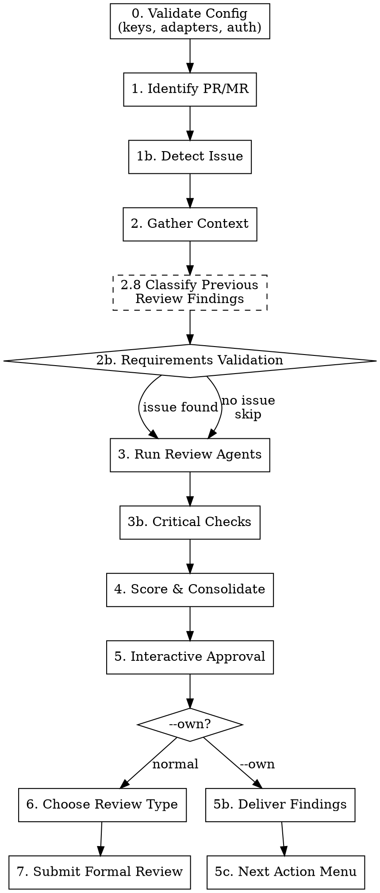

# flowyeah:review — PR/MR Review Pipeline

Reviews a pull request or merge request. Runs review agents, validates requirements, checks for critical patterns, and submits a formal review with inline comments. With `--own`, collects findings for self-audit without submitting. With `finalize`, tears down review state.

```
flowyeah:review [--own] [<number>]
flowyeah:review finalize [<number>]
```

## Argument Parsing

If the first positional argument is `finalize`, the second positional (if present) is the PR number to finalize; otherwise, auto-detect from current branch. For non-finalize invocations, treat the positional as a PR number. The `--own` flag can appear in any position. `finalize` ignores `--own` — it operates on whatever active review session exists regardless of mode.

## Pipeline



## Configuration

Uses `flowyeah.yml` from the project root (see `config-schema.md` at the plugin root for full schema and defaults). **If missing, load `setup.md` from the plugin root and follow its interactive setup instructions before proceeding.**

The review skill uses: `code_review.agents`, `code_review.optional_agents`, `code_review.instructions`, `git_host`, `language`, and adapter configs for issue detection.

**If `code_review.agents` is empty or missing: STOP and complain.**

## Platform Detection

The review adapter is determined from `git_host` in `flowyeah.yml`:

| `git_host` | Review adapter |
|------------|----------------|
| `gitlab` | `adapters/gitlab/review.md` |
| `github` | `adapters/github/review.md` |

Load the review adapter once at the start. **If the git host adapter has no `review.md`, STOP** — that adapter doesn't support code reviews. All platform-specific operations (fetch PR, post review, detect issue) go through the adapter.

## Session (Lightweight)

Create `.flowyeah/review-state-{number}.md` for compaction resilience:

```markdown
# Current State

Type: review
Mode: <own or absent>
Status: Reviewing
PR/MR: <number>
Branch: <source_branch>
Platform: <adapter>
Findings: <count> total, <approved> approved
Phase: <current_phase>
```

`Mode` is absent for normal reviews. The hook does not interpret this field — it dumps the state file as raw text. The skill's crash recovery logic reads `Mode` to decide which path to follow on resume.

**Valid `Phase` values** (map to steps, used for crash recovery):

| Phase | Step | Recovery action |
|-------|------|-----------------|
| `Validating Config` | 0 | Re-run from start |
| `Identifying PR` | 1-1b | Re-run from start |
| `Gathering Context` | 2-2b | Re-run context gathering |
| `Running Agents` | 3-3b | Re-run agents (results lost) |
| `Scoring` | 4 | Re-run scoring (agent results lost) |
| `Interactive Approval` | 5 | Read `review-approved-{number}.md`, re-present unapproved findings |
| `Choosing Review Type` | 6 | Re-ask review type question |
| `Submitting Review` | 7 | Check if review was posted, retry or clean up |
| `Findings Delivered` | 5b-5c | Re-present the next action menu. If `review-approved-{number}.md` is missing, re-run from step 5 (Interactive Approval). |
| `Fixing` | after 5c | Do not resume the review pipeline. Findings are informational context. |
| `Delegated` | after 5c | Do not resume the review pipeline. Findings are informational context for the next session. |

After the user makes approval decisions (step 5), persist results to `.flowyeah/review-approved-{number}.md`:

```markdown
# Approved Findings

## Finding 1
- File: app/models/payment.rb:42
- Label: issue (blocking)
- Body: |
    **issue (blocking):** Race condition na criação de pagamento
    ...

## Finding 2
...
```

This file ensures that if compaction or a crash interrupts after approval, approved findings are recoverable.

Review sessions use `review-state-{number}.md` (not `state.md`) so they never interfere with build sessions in worktrees. Both can coexist — the injection hook handles them separately.

Update `review-state-{number}.md` after each phase transition. The hook injection ensures state survives compaction.

No `mission.md`, `progress.md`, or full `findings.md` — reviews are short-lived. Only `review-approved-{number}.md` is needed for the approval checkpoint.

### Crash Recovery

If a review session is interrupted (compaction, crash, user abort):

1. The hook injects `review-state-{number}.md` into the next prompt
2. Resume from the last recorded phase
3. If the phase was before "Interactive Approval" (step 5), re-run from that phase
4. If during or after approval, read `review-approved-{number}.md` to recover previously approved findings and skip re-presenting them
5. If the review was already submitted, clean up both state files
6. The user can also run `/review finalize` at any time to abandon the review and clean up state files

#### Crash Recovery with `Mode: own`

When `Mode` is absent, the logic above applies unchanged (resume from recorded phase, proceed through steps 6-7).

When resuming a session with `Mode: own`:
- Phases before `Findings Delivered` — recover normally (re-run from that phase), but skip steps 6-7 after completion.
- `Findings Delivered` — re-present the next action menu (step 5c).
- `Fixing` or `Delegated` — do nothing. The review pipeline is not active. State files serve as context only.

## Steps

### 0. Validate Configuration

**Worktree guard:** if the current working directory is inside a flowyeah build worktree (`git rev-parse --show-toplevel` contains `.flowyeah/worktrees/`), **STOP.** Reviews must run from the main checkout — review session files (`.flowyeah/review-state-{number}.md`) belong to the main checkout, not to build worktrees.

Before starting the review, validate the loaded `flowyeah.yml`:

1. **Load schema:** read `config-schema.md` from the plugin root.
2. **Check required keys:** `git_host` must point to an adapter with `review.md`. `code_review.agents` must be non-empty.
3. **Load review instructions:** if `code_review.instructions` is present in the config, validate the path is relative and the file exists (per validation rules in `config-schema.md`). Read the file contents once and carry them through the pipeline.
4. **Run validation rules:** execute relevant checks from the "Validation Rules" section of the schema.
5. **Auth verification:** verify credentials for the git host adapter and any source adapters that will be used for issue detection.
6. **Report all issues at once** — collect validation failures and present together.

If validation fails, STOP with actionable error messages.

### 1. Identify PR/MR

If `<number>` is provided, use it. Otherwise, detect from current branch via the review adapter.

Display PR/MR summary: title, author, branch, additions/deletions, changed files.

### 1b. Detect Associated Issue

Extract issue slug from the branch name. The patterns depend on the project's issue tracking:

**From configured adapters with `source.md`:**
- If `linear` is configured → try Linear patterns (e.g., `proj-eng-302`, `TEAM-123`)
- If `gitlab` is configured → try GitLab patterns (e.g., leading digits, `feat/42`)
- If `github` is configured → try GitHub patterns (e.g., `feat/42`)

Fetch issue details using the appropriate source adapter (load `adapters/<source>/connection.md` + `adapters/<source>/source.md`).

**If no issue found:** ask the user. If they say "none", skip requirements validation (step 2b).

### 2. Gather Context

Collect in parallel:

1. **PR/MR diff** — via review adapter
2. **Files changed** — via review adapter
3. **Commit messages** — via review adapter
4. **CLAUDE.md files** — find all: global (`~/.claude/CLAUDE.md`), project root, `.claude/CLAUDE.md`, `.claude/standards/*.md`
5. **Git history** — for each changed file: `git log --oneline -10 <file>`
6. **Git blame** — for changed lines, run `git blame` on the base branch version to understand original intent and authorship
7. **Previous PR/MR feedback** — search recent merged PRs/MRs that touched the same files, collect review comments (via review adapter). Look for recurring themes — if a reviewer flagged the same pattern before, it's worth flagging again
8. **Previous review findings** — via review adapter's `Fetch Own Discussions`. Fetch all discussions/review comments authored by the authenticated user on this MR/PR. Parse Conventional Comments format to extract structured findings. If none found (first review), skip previous-review logic entirely
9. **Other reviewers' open threads** — via review adapter, fetch all open (unresolved) review threads on the current PR/MR from other reviewers. For each thread, note: author, file:line, concern raised. Use these to avoid duplicating what others already flagged and to identify opportunities to complement their feedback (e.g., adding technical context, confirming a concern, or expanding on a suggestion)

#### 2.8 Classify Previous Review Findings

**Skip if no previous review discussions were found (first review).**

For each parsed previous finding, classify using the hybrid approach:

```
Resolved on platform?
├── yes → ADDRESSED
└── no
    └── Finding has file:line AND line falls within a changed hunk in the diff?
        ├── no → UNRESOLVED
        └── yes
            └── Semantic check: does the new code at that location address the concern?
                ├── uncertain/no → UNRESOLVED
                └── yes → ADDRESSED
```

**"Line changed"** — compare the finding's `file:line` against the MR/PR diff (already fetched in step 2.1). If the line falls within a changed hunk, it counts as changed.

**Semantic check** — read the previous finding's body and the new code at that location. Ask: "did the author's change target this specific concern?" When uncertain, classify as **unresolved** (safer to re-present than to silently drop).

Calibration examples:

| Finding | New code | Classification | Why |
|---------|----------|----------------|-----|
| Missing null check on `user.email` | Added `return unless user.email` guard | ADDRESSED | Directly targets the flagged concern |
| Race condition in payment creation | Added DB-level unique constraint + `RecordNotUnique` rescue | ADDRESSED | Solves the concurrency problem, even if differently than suggested |
| Missing error handling in API call | Line changed to rename a variable | UNRESOLVED | Change is unrelated to the concern |
| N+1 query in `orders#index` | Added `# TODO: fix N+1` comment | UNRESOLVED | Acknowledging isn't addressing |
| Performance concern on large datasets | Method rewritten with different logic in the area | UNCERTAIN → UNRESOLVED | Code changed but unclear if the concern was targeted |

**Findings without file:line** (review body findings) — can't be diff-checked. Classify as **unresolved** unless resolved on the platform.

**Output:** two lists — `addressed_findings[]` and `unresolved_findings[]`.

### 2b. Requirements Validation

**Skip if no issue was found in step 1b.**

Analyze in 3 dimensions:

**Completeness:** Does the implementation cover everything the issue asks for? For each requirement/acceptance criterion in the issue, check if the diff contains corresponding implementation. Generate a finding for unimplemented requirements.

**Scope:** Is there code unrelated to what the issue asks for? Compare changed files/logic against the issue's scope. Use good judgment — refactoring needed for the feature IS pertinent.

**Coherence:** Does the implementation approach make sense to solve the described problem? Flag when the implementation seems to solve a different problem than what the issue describes.

### 3. Run Review Agents

Launch agents from `code_review.agents` in parallel using the Task tool:

- Pass each agent the PR diff and changed files
- Each agent returns findings as: file, line, issue, severity, confidence (0-100)

If `code_review.instructions` is configured, include the file contents as additional context passed to each agent alongside the PR diff and changed files.

If `unresolved_findings[]` from step 2.8 is non-empty, pass them to each agent as additional context: "The following findings were raised in a previous review and remain unresolved. Do not re-flag these — they will be carried forward separately." This prevents agents from producing duplicates.

**Conditional agents** from `code_review.optional_agents` — launch based on what changed (e.g., security analyst if auth code was touched). Use judgment.

**Note:** This is the same agent configuration used by `flowyeah:build` in step 7b (CI + Code Review Loop). Both skills share the `code_review.agents` and `code_review.optional_agents` lists from `flowyeah.yml`. The difference: build runs agents as a quality gate before merge; review produces a formal review artifact with inline comments.

### 3b. Critical Checks

Run directly (not delegated to agents):

**Database Concurrency:** For any migration adding an index, verify if it should be unique. Application-level validations are NOT sufficient for concurrency — DB constraints are required. If a unique index exists, check for `RecordNotUnique` rescue.

**API Backward Compatibility:** For any migration removing columns, search serializers, API responses, and webhooks. Exposed columns CANNOT be removed — must be deprecated.

**CLAUDE.md Compliance:** Check global and project CLAUDE.md rules against the diff (e.g., ABOUTME comments, naming conventions, error handling).

**Naming Consistency:** Flag semantic inconsistencies — names that contradict each other, method names that don't match behavior.

**Project Review Guidelines:** If `code_review.instructions` is configured, evaluate the diff against each guideline in the instructions file. Default scoring: severity `issue`, confidence 75. Adjust based on how clearly the diff violates a guideline.

**Scoring for critical checks:** DB concurrency and API backward compatibility findings default to severity `issue (blocking)` with confidence 90. CLAUDE.md compliance defaults to severity `issue` with confidence 75. Naming consistency defaults to `suggestion (non-blocking)` with confidence 50. Adjust based on evidence.

### 4. Score & Consolidate

**Severity** (determined by the Conventional Comments label):

| Severity | Label | Description |
|----------|-------|-------------|
| Blocker | `issue (blocking)` | Must fix before merge. Will cause production bugs. |
| Important | `issue` | Should be fixed. May cause problems. |
| Suggestion | `suggestion (non-blocking)` | Nice to have. Improves code quality. |
| Nitpick | `nitpick (non-blocking)` | Minor. Only mention if few other issues. |
| Informational | `question`, `thought`, `note` | Not a fix request — seeks clarification or shares context. |

**Confidence scoring (0-100)** — how certain you are that the finding is real:

| Score | Meaning |
|-------|---------|
| 0 | False positive |
| 25 | Might be real, couldn't verify. Stylistic issue not in CLAUDE.md |
| 50 | Verified real issue, minor or nitpick |
| 75 | Highly confident. Verified, impacts functionality, or explicitly in CLAUDE.md |
| 100 | Absolutely certain. Confirmed, will happen frequently |

**Consolidate findings:**
1. Remove duplicates (same file+line+issue from multiple sources)
2. Sort by severity (blocker first), then by confidence within each severity level
3. Group by category
4. Deduplicate against previous findings — if an agent finding matches an unresolved previous finding (same file, overlapping lines, same concern), remove the agent finding in favor of the previous one. The previous finding carries more weight as a "previously raised" item
5. Deduplicate against other reviewers' open threads — if a finding raises the same concern another reviewer already flagged (same file, overlapping lines, same issue), drop the finding. Instead, if you have useful context to add, note it for a reply to their thread (see step 5 presentation). Don't repeat what someone else already said
6. Inject `unresolved_findings[]` into the consolidated list. Each gets tagged `(previously raised, still unresolved)`. They keep their original severity — no escalation, no demotion

**False positive rubric — do NOT flag:**
- Something that looks like a bug but isn't
- Pedantic nitpicks a senior engineer wouldn't mention
- Issues linters/typecheckers/CI will catch
- General quality issues unless explicitly in CLAUDE.md
- Issues silenced with lint-ignore comments
- Language-specific linter defaults in generated/migration files (e.g., Ruby's `frozen_string_literal` in migrations)

**"Touched it, own it":** If the PR touches a file (even for refactoring), the author is responsible for issues in that code. Only truly untouched lines are excluded.

### 5. Interactive Approval

Present **all findings at once** as a numbered list. Each finding uses its full format:

```
═══════════════════════════════════════════════════════════
Finding 1
═══════════════════════════════════════════════════════════

Label:      [issue/suggestion/nitpick/...] ([blocking/non-blocking])
Confidence: [score]/100
File:       [path:line]
Source:     [agent/analysis that found it]

Comment (Conventional Comments format):
┌─────────────────────────────────────────────────────────
│ **[label] ([decoration]):** [subject]
│
│ [discussion - context, justification, suggested code]
└─────────────────────────────────────────────────────────

═══════════════════════════════════════════════════════════
Finding 2  ⟳ PREVIOUSLY RAISED
═══════════════════════════════════════════════════════════

Label:      [original label] ([original decoration])
Confidence: [original score]/100
File:       [path:line]
Source:     previous review

Comment (Conventional Comments format):
┌─────────────────────────────────────────────────────────
│ **[label] ([decoration]):** [subject]
│
│ ⟳ Previously flagged, still unresolved.
│ [original discussion body]
└─────────────────────────────────────────────────────────

... (all remaining findings)
```

**Other reviewers' open threads:** After the findings list, if any open threads from other reviewers were found (step 2.9) and you have complementary context to add (technical justification, confirmation with evidence, expanded scope), present them separately:

```
───────────────────────────────────────────────────────
Other reviewers' open threads — complement opportunities
───────────────────────────────────────────────────────

Thread A (@reviewer · file:line):
  Their concern: [summary]
  Your complement: [what you'd add — e.g., confirming with evidence, expanding scope]

Thread B (@reviewer · file:line):
  Their concern: [summary]
  Your complement: [what you'd add]
```

These are **not** findings — they are reply suggestions. The user can approve, edit, or skip each. Approved complements are posted as replies to the existing threads (via the review adapter) alongside the formal review submission in step 7.

After presenting the full list, ask the user for a **batch decision**:

1. **Approve all** — include every finding in the review
2. **Select specific** — user provides finding numbers to include (e.g., `1,3,5`). Everything else is skipped
3. **Skip below severity** — approve all findings, skip those below a severity threshold (e.g., skip nitpicks)
4. **Discard all** — submit review with no inline findings

If the user selects specific findings and wants to **edit** any before submission, ask which numbers to edit and expand them one at a time for modification.

Persist approved findings to `review-approved-{number}.md` after the batch decision is made.

### `--own` Mode: Steps 5b-5c

**If `--own` flag was NOT provided, skip to step 6.**

#### 5b. Deliver Findings

Persist approved findings to `review-approved-{number}.md` (already done in step 5). Present them as an actionable summary — a concise list showing file, label, and subject for each finding.

Update `review-state-{number}.md`: set `Phase: Findings Delivered`.

#### 5c. Next Action Menu

Offer three options:

1. **Fix now** — the skill pipeline terminates. Phase is set to `Fixing`. State files remain as informational context (the hook injects them each prompt, but they do not trigger the review pipeline). When done, the user runs `/review finalize` to clean up.
2. **Delegate** — the skill pipeline terminates. Phase is set to `Delegated`. State files remain so the hook injects a findings summary into the next session. The hook only injects finding headers (number, file, label) — the next session should read `.flowyeah/review-approved-{number}.md` directly for full finding details. The next session uses the findings as guidance for what to fix — it does not resume the review pipeline. When done, the user (in any session) runs `/review finalize` to clean up.
3. **Finalize** — clean up state files immediately (equivalent to `/review finalize`).

#### Conflict: Re-invoking `/review` with active session on same branch

Before starting a new review, glob `review-state-*.md` and match `Branch:` against the current branch.

If a match is found with `Phase: Fixing` or `Phase: Delegated`, present: "An --own review for PR #N is still active. Finalize it first, or continue fixing?"

If a match is found with any other phase, present: "A review for PR #N is already active on this branch (phase: X). Finalize it first?"

If the user chooses to finalize, run the finalize logic and stop. The user must re-invoke `/review` for a new session.

### 6. Choose Review Type

After all findings are processed, present the recommendation and ask the user:

**Recommendation logic** (based on approved findings):
- If any approved finding has label `issue (blocking)` → recommend **Request Changes**
- Else if any approved finding has label `issue` → recommend **Comment**
- Else (only suggestions, nitpicks, praise, or no findings) → recommend **Approve**

Present the recommendation alongside the options. Mark the recommended option:

1. **Request Changes** — formal review requesting changes
2. **Comment** — formal review with comments only
3. **Approve** — approve with observations

### 7. Submit Formal Review

**MANDATORY:** Always submit as a formal platform review with inline comments. Never post a generic timeline comment.

Load the review adapter and follow its instructions to:

1. Build inline comments array — **every approved finding** becomes an inline comment. If a finding lacks a precise line, find the best anchor (see Error Handling). No findings go in the review body — the body is a summary, not a fallback destination.
2. Build review body (consolidated summary only — requirements validation, previous review follow-up, and overview. No findings.)
3. Submit the formal review with the event type chosen in step 6

**All inline comments use [Conventional Comments](https://conventionalcomments.org/) format:**

```
**<label> [decorations]:** <subject>

[discussion]
```

**Labels:** `praise`, `issue`, `suggestion`, `todo`, `question`, `thought`, `nitpick`, `chore`, `note`

**Decorations:** `(blocking)`, `(non-blocking)`, `(if-minor)`

**Include at least one `praise` comment per review** — but never false praise. Look for something to sincerely praise.

Ask for final confirmation before posting.

**APPROVE review comment placement:** When the event is `APPROVE`, split findings by type:
- **Praise findings** → include in the review body only (the approval itself is the positive signal; inline praise is noise)
- **Non-praise findings** (suggestions, issues, nitpicks, questions, etc.) → submit as inline comments to create open threads, ensuring they get read

This differs from `COMMENT` and `REQUEST CHANGES`, where all findings (including praise) are posted as inline comments. The review adapter's event documentation has the details.

After posting (or if the user discards), remove `.flowyeah/review-state-{number}.md` and `.flowyeah/review-approved-{number}.md` to end the session.

### `finalize` Subcommand

A separate entry point that tears down review state. Not a pipeline step.

```
flowyeah:review finalize [<number>]
```

**With explicit number:** target `review-state-{number}.md` directly. If absent, report "No active review for PR #{number}." and stop.

**Without number (auto-detect):**
1. Get current branch
2. Glob `review-state-*.md`, extract `Branch:` from each
3. Zero matches → list all active reviews (PR number + branch from each state file) and ask which to finalize
4. One match → use it
5. Multiple matches → list and ask

After resolving the target:
1. Read the state file. Display: PR number, findings count, mode.
2. Delete `review-state-{number}.md` and `review-approved-{number}.md` (if present).
3. Report: "Review session finalized."

No confirmation prompt — the explicit `finalize` command is sufficient intent.

No platform interaction. No re-running agents. No verification of whether findings were addressed.

`finalize` works on any review session — both `--own` and normal. For normal reviews interrupted mid-pipeline (e.g., crashed after step 3), `finalize` serves as an escape hatch to discard the session without submitting.

`finalize` does not display the timing summary.

### Review Body Template

```markdown
## Code Review

### Requirements Validation
<!-- Only if issue was found -->
**Issue:** [slug](link) — "Issue title"

#### Requirement Coverage
- ✅ Requirement A — implemented in `app/services/...`
- ❌ Requirement B — not found in diff
- ⚠️ Requirement C — partial implementation

### Previous Review Follow-up
<!-- Only if previous review findings were found -->

#### Resolved
- ✅ `file:line` — [subject] ([resolution reason: resolved on platform / code changed, addresses concern])

#### Still Unresolved
- ⟳ `file:line` — [subject] (see inline comment)

### Code Review Summary
[consolidated summary of findings]
```

## Timing

After the review is submitted (or discarded), display a summary:

```
Review complete — N findings (M approved, K skipped)
  Blockers: X | Important: X | Suggestions: X
  Automated phases: ~Xs | Interactive approval: ~Xs
```

No per-phase instrumentation needed. Just track two timestamps: start of step 0 and start of step 5 (interactive approval). The difference gives automated time; wall clock from step 5 to end gives interactive time.

## Comment Language

Review comments are written in the language configured in `language`. Default: `en`.

## Error Handling

| Error | Action |
|-------|--------|
| PR/MR not found | Ask user for number/URL |
| Agent fails | Report which failed, continue with others |
| Remote communication failure (401, 403, 429, 5xx, timeout) | Retry up to 2 times with a short pause. If still failing, **STOP and report the error to the user.** Do not attempt alternative approaches or workarounds. |
| Inline comment position not in diff | Find the best anchor: the most relevant changed line in the same file, or the file's first changed line. If the file has no changed lines at all (finding from a cross-cutting concern), anchor on the most relevant file's first changed hunk. Every finding MUST become an inline comment — never move findings to the review body. |

## Never

**Note:** The submission rules below apply to the normal review path (steps 6-7). `--own` mode does not submit — these rules do not apply to self-audit reviews.

- Post without explicit user approval
- Include findings the user skipped
- Use `gh pr review --comment --body` (that's not an inline review)
- Post a generic timeline comment instead of a formal review
- Skip the review type question
- Submit a review without inline comments (when there are approved findings with file:line)
- Put findings in the review body instead of as inline comments. Every finding is a stop-point for the reviewed developer — it must create an open thread they need to resolve. The review body is a summary layer only.
